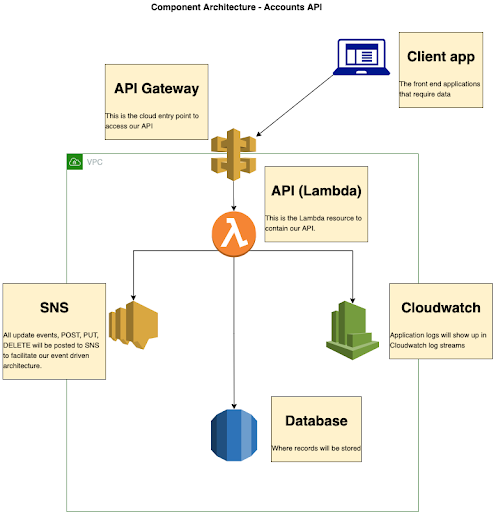
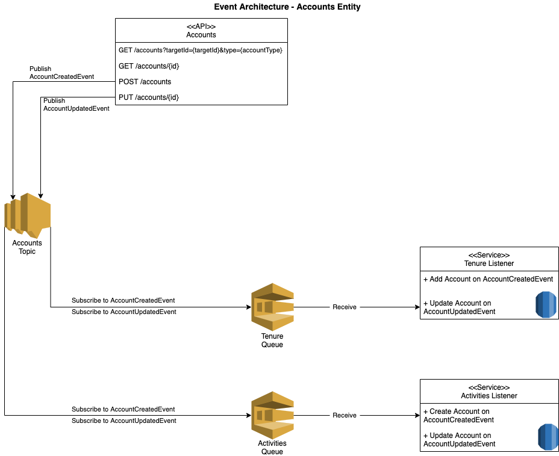

## Purpose
To identify all information to be captured with regards to the Accounts domain. 
As part of our solution we are proposing to develop an Account entity and API that will serve accounts related data for our housing streams and any other projects that may require information relating to an account. This means that we can offer a deeper, more citizen-centric self-service capability, enabling even more service transactions to be carried out online. 
For the purposes of establishing context, the definition of an account as it relates to this entity is a record of a financial basis that links a user to a service. 

## Functions
- Accounts - Account information relating to a person or organisation.  This could be for a person’s rent account, benefit account or any other account a person (or organisation) may hold with the council.
- Accounts in arrears - Accounts in arrears categorised by account types (service charges, major works, secure tenancies, non-secure tenancies)

## Vision
A single, centralized data source, holding all account data, updated by multiple services.
A reusable microservice API used for managing account related data.
Avoidance of any duplication of data, a normalised view of an account.
Reducing development costs across all streams.
A decoupled architecture that allows this entity to be reused across multiple services.

## User Needs
- As a service user I would like to see what accounts I have for the various services I subscribe to with the council so that I can have a clear view of what my financial status is with regards to the council.
- As a service user I would like to see what my account balance is with each service that I subscribe to so that I can see what financial commitments I have.
- As a caseworker I would like to be able to quickly identify accounts that are in arrears so that I can prioritise cases that need to be actioned more effectively.
- As a developer, I want to:
    - Reuse a single Accounts microservice so that development efforts can be focused on other requirements.
    - Ensure data updated, retrieved and inserted is consistent across services and reliable.
    - Have an easy way to retrieve any data related to an account so that I don’t need to make additional calls to find references for related systems.

## Data Meetup Outcome
Accounts workshop - https://ideaflip.com/b/75dgi3rx6h2t/

## Endpoints to be created
1. GET **//accounts?targetId={targetId}&type={accountType}**

    **Function:** Gets a collection of accounts for a person or organisation

	**Response Payload:**
    ```
	[
		{
			"id": "74c5fbc4-2fc8-40dc-896a-0cfa671fc832",
			"paymentReference": "[to confirm format]",
			"parentAccountId": "[id of the master account]",
			"targetType": "Tenure",
			"targetId": "123456",
			"accountType": "Recharge, Sundry, Master, etc",
			"rentGroupType": "Major Works, etc",
			"agreementType": "M, R, S, X",
			"accountBalance": 317.54,
			"consolidatedBalance": 615.32,
			"createdAt": "2021-03-29T15:10:37.471Z",
			"createdBy": "Admin",
			"lastUpdatedAt": "2021-03-29T15:10:37.471Z",
			"lastUpdatedBy": "Staff",
			"startDate": "2021-03-29T15:10:37.471Z",
			"endDate": "2015-07-20",
			"accountStatus": "active",
			"consolidatedCharges": [
				{
					"type": "rent",
					"frequency": "weekly",
					"amount": "101.20"
				},
				{
					"type": "service charges",
					"frequency": "weekly",
					"amount": "100.20"
				}
			],
			"tenure": {
				"tenureId": 31254,
				"tenureType": {
					"Code": "PVG",
					"Description": "Private Garage"
				},
				"primaryTenants": [
					{
						"id": "74c5fbc4-2fc8-40dc-896a-0cfa671fc832",
						"fullName": "John Smith"
					}
				],
				"fullAddress": "1 Hillman Street, Hackney, E8 1DY"
			}
		}
	]
    ```

2. GET **/accounts/arrears?type={accountType}&sort={propertyName}&direction={asc/desc}&resultsCount=[number of items]**

    **Function:** Gets a collection of accounts that are in arrears

    **Response Payload:**
    ```
	[
		{
			"id": "74c5fbc4-2fc8-40dc-896a-0cfa671fc832",
			"paymentReference": "[to confirm format]",
			"parentAccount": "[id of the master account]",
			"targetType": "Tenure",
			"targetId": "123456",
			"accountType": "Recharge, Sundry, Master, etc",
			"rentGroupType": "Major Works, etc",
			"agreementType": "",
			"accountBalance": 317.54,
			"consolidatedBalance": 615.32,
			"createdAt": "2021-03-29T15:10:37.471Z",
			"createdBy": "Admin",
			"lastUpdatedAtDate": "2021-03-29T15:10:37.471Z",
			"lastUpdatedBy": "Staff",
			"startDate": "2021-03-29T15:10:37.471Z",
			"endDate": "2015-07-20",
			"accountStatus": "active",
			"consolidatedCharges": [
				{
					"type": "rent",
					"frequency": "weekly",
					"amount": "101.20"
				},
				{
					"type": "service charges",
					"frequency": "weekly",
					"amount": "100.20"
				}
			],
			"tenure": {
				"tenureId": 31254,
				"tenureType": {
					"Code": "PVG",
					"Description": "Private Garage"
				},
				"primaryTenants": [
					{
						"id": "74c5fbc4-2fc8-40dc-896a-0cfa671fc832",
						"fullName": ""
					}
				]
			}
		}
	]
    ```

3. GET **/accounts/{id}**

    **Function:** Gets a single account record from the supplied id

    **Response Payload: **
    ```
	{
		"id": "74c5fbc4-2fc8-40dc-896a-0cfa671fc832",
		"paymentReference": "[to confirm format]",
		"parentAccount": "[id of the master account]",
		"targetType": "Tenure",
		"targetId": "123456",
		"accountType": "Recharge, Sundry, Master, etc",
		"rentGroupType": "Major Works, etc",
		"agreementType": "",
		"accountBalance": 317.54,
		"consolidatedBalance": 615.32,
		"createdAt": "2021-03-29T15:10:37.471Z",
		"createdBy": "Admin",
		"lastUpdatedAtDate": "2021-03-29T15:10:37.471Z",
		"lastUpdatedBy": "Staff",
		"startDate": "2021-03-29T15:10:37.471Z",
		"endDate": "2015-07-20",
		"accountStatus": "active",
		"consolidatedCharges": [
			{
				"type": "rent",
				"frequency": "weekly",
				"amount": "101.20"
			},
			{
				"type": "service charges",
				"frequency": "weekly",
				"amount": "100.20"
			}
		],
		"tenure": {
			"tenureId": 31254,
			"tenureType": {
				"Code": "PVG",
				"Description": "Private Garage"
			},
			"tenureType": "",
			"primaryTenants": [
				{
					"id": "74c5fbc4-2fc8-40dc-896a-0cfa671fc832",
					"fullName": ""
				}
			],
			"fullAddress": "1 Hillman Street, Hackney, E8 1DY"
		}
	}
    ```

4. POST **/accounts**

    **Function:** Creates a new account for a person

    **Request Payload:**
    ```
    {
		"parentAccount": "74c5fbc4-2fc8-40dc-896a-0cfa671fc435",
		"paymentReference": "123234345",
		"TargetType": "Tenure, Licensing, HousingBenefit",
		"TargetId": 123456, //id of target entity, e.g. tenure record
		"accountType": "Recharge, Master, etc",
		"rentGroupType": "Major Works, etc",
		"agreementType":"",
		"createdBy": "Admin",
		"lastUpdatedBy": "Admin",
		"AccountStatus": "active"
    }
    ```
    **Response Payload:**
    ```
	{
		"id": "74c5fbc4-2fc8-40dc-896a-0cfa671fc832",
		"parentAccount": "74c5fbc4-2fc8-40dc-896a-0cfa671fc435",
		"paymentReference": "123234345",
		"TargetType": "Tenure, Licensing, HousingBenefit",
		"TargetId": 123456,
		"accountType": "Recharge, Master, etc",
		"rentGroupType": "Major Works, etc",
		"agreementType": "",
		"createdBy": "Admin",
		"lastUpdatedBy": "Admin",
		"createdAt": "2021-03-29T15:10:37.4710000+00:00",
		"lastUpdatedAt": "2021-03-29T15:10:37.4710000+00:00",
		"StartDate": "2021-03-29T15:10:37.471Z",
		"endDate": "2021-03-29T15:10:37.4710000+00:00",
		"AccountStatus": "active"
	}
    ```

5. PATCH **/accounts/{id}**

    **Function:** Updates a person’s account details
    
    **Request Payload:**
    ```
	[
		{
			"value": [
				{
					"Type": "Rent",
					"Frequency": "Weekly",
					"Amount": 1200
				},
				{
					"Type": "Service",
					"Frequency": "Monthly",
					"Amount": 2200
				}
			],
			"path": "ConsolidatedCharges",
			"op": "add"
		},
		{
			"value": 300,
			"path": "AccountBalance",
			"op": "replace"
		},
		{
			"value": 850,
			"path": "consolidatedBalance",
			"op": "replace"
		},
		{
			"value": "2021-03-29T15:10:37.4710000Z",
			"path": "endDate",
			"op": "replace"
		}
	]
    ```

## Properties/Column Mappings
The following db columns have been identified as common and useful in the context of an account.

| Name | Type | Table Field Name | Description | 
|------|------|------------------|-------------|
| Id | GUID | id | A unique id in the database |
| TargetId | String | target_id | A reference to the person holding this account|
| TargetType | String | target_type | Referenced from the collection of target types sub table |
| AccountType | String | account_type | The type of account, eg Recharge, Sundry, Master |
| RentGroupType | String | rent_group_type | Eg MajorWorks |
| AgreementType | String | agreement_type | |
| AccountBalance | Number | account_balance | The current balance of the account (calculated based on activity on the account such as charges, payments, etc) |
| ConsolidatedBalance | Number | consolidated_balance | The summarized balance amount of the all related account to the master one |
| ParentAccountId | String/Varchar | parent_account_id | The main and master account which includes child accounts too. |
| PaymentReference | String/Varchar | payment_reference | A user friendly reference for an account (calculated - Ibrahim has the formula) |
| CreatedAt | TimeStamp | created_date | The date the account was created |
| CreatedBy | String | created_by | The user who created the record |
| LastUpdatedBy | String | last_updated_by | The last user who updated the record |
| LastUpdatedAt | TimeStamp | last_updated | When last the account record was updated |
| StartDate | TimeStamp | start_date | Date the account was opened |
| EndDate | TimeStamp | end_date | Date the account was closed |
| EndReasonCode | String | end_reason_code | The reason for the account ending |
| ConsolidatedCharges | Object | consolidated_charges | See breakdown of consolidated charges |
| Tenure | Object | tenure | Includes the information about the tenancy and responsible person |
| AccountStatus | String | account_status | Active, suspended or ended |


**Target Types**

| Name | Type | Table Field Name | Description |
|------|------|------------------|-------------|
| Id | GUID | id | A unique id in the database |
| TargetType | String | target_type | The type of the target |
| Polarity | String | polarity | Determine whether or not a positive amount is a payment to someone or a payment from someone. |


**Consolidated Charges**

| Name | Type | Table Field Name | Description |
|------|------|------------------|-------------|
| Type | String | | The type of charge/s |
| Frequency | String | | How often the charge/s get applied |
| Amount | Number | | The consolidated charge amount |

**Tenure**

| Name | Type | Table Field Name | Description |
|------|------|------------------|-------------|
| TenureId | String | TenureId | The tenancy id provided to the tenant |
| TenureType | Object | TenureType | Type of tenancy agreement such as Introductory |
| FullAddress | String | FullAddress | The tenured asset full address |
| PrimaryTenants | Array of Object | PrimaryTenants | Who is the responsible of this tenancy agreement |

**PrimaryTenants**

| Name | Type | Table Field Name | Description |
|------|------|------------------|-------------|
| Id | String | PersonId |	|
| FullName | String | FullName |	|


**TenureType**

| Name | Type | Table Field Name | Description |
|------|------|------------------|-------------|
| Code | String | Code |	|
| Description | String | Description |	|


## Other considerations
- How do we reflect positive and negative activities on an account?  
- Do we need to supply an account balance at a specific date? - Let’s not do this.
- Do we want to have a further breakdown within this API of what makes up an account balance?

## Dependent Entities
- Tenants & Leaseholders
- Income Services
- Revenue & Benefits

## Component Architecture


## Event Driven Architecture
