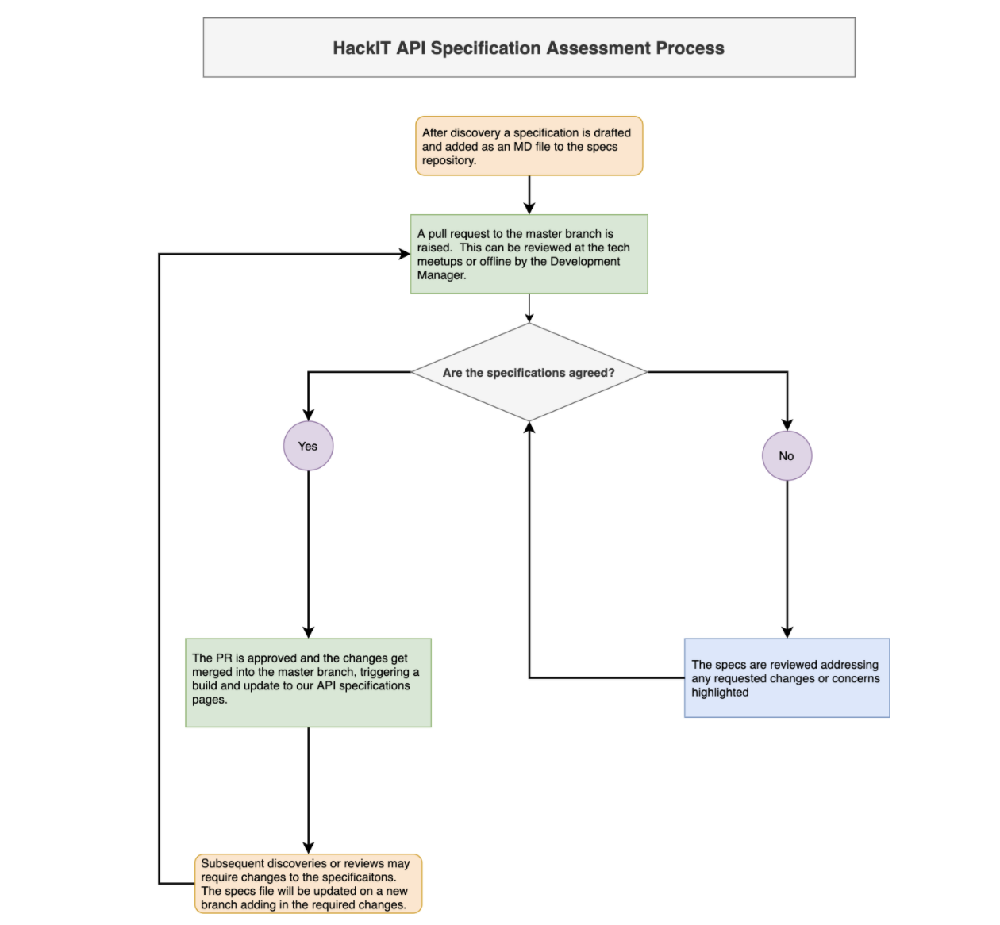

## Purpose
The purpose of this process is to provide a clear,open and  consistent method of providing new and amended API specifications, evaluating them and getting them published in a way that is easy for a wider audience to access.

Our API specifications have become a fundamental part of our API development process; all new APIs begin from a set of design specifications.  As the number of APIs we are developing continues to grow, we have begun to identify areas of inconsistency that we want to be able to improve on including:

- Where the specifications are stored - specs tend to be stored in different locations by different projects making them difficult to track down when needed which ends up re-inventing the wheel.  If they cannot be found then we lose their value.
- The review and approval process - once a specification has been approved, if there needs to be changes to the specifications, there needs to be a consistent approach for getting this done or we risk implementing changes that could present any of a number of risks to consumers of the API including developing against outdated specifications and systems not working as expected.

Our API specifications are different from the API documentation in Swagger whose main purpose is to describe the various endpoints of the APIs.  The specifications add more light into the design process and attempt to capture the decisions behind approaches or changes to an API along with the user and data needs.  This further contributes to building our APIs in a more consistent way as departures from the standard set of tools and methodologies can be clearly documented here.

We believe in the value of collaboration and having colleagues contribute to the design process allows for shared learning and potentially improves the quality of the output of these reusable APIs.  Having this process in place allows us to inject a diverse set of knowledge into the design of the API which would lead to positive and consistent outcomes for our development.

## Vision

- A single, centralised repository holding all of our API design specifications.
- A way to easily and consistently access published API specifications in a way that is familiar to people.
- A way to standardise the management of changes to specifications.
- A way to link the API specifications to the API catalog going forward.

## Developer Needs
- As a developer I want a way to easily find API specifications so that I can better understand and use these APIs effectively as well as stay up to date on any changes that may affect my product.
- As a developer I want to be able to publish specifications in a way that colleagues, stakeholders and interested parties can easily access and provide feedback on.

## The Assessment Process
Below is a diagram that provides some illustration of the process for assessing/evaluating our API specifications.  Each step in the process is expanded upon a bit further:

** Draft Specification ** - The individual or project will draft the API specification as part of their internal design process, ensuring that the specification meets the needs of the identified users and follows our development standards as outlined in the API Playbook.  Once the draft is completed it should be exported to an MD (markdown) file and added to the API specifications repository [repository url to be added].

** Raise the PR ** - Once the specification is ready for review, a pull request is raised to facilitate review and merge into the main branch.  If this is a new document, a link to it should be added to the repository’s navigation component.  A pull request can be reviewed either collaboratively at our tech meetups or offline by the development manager with a retrospective review if the pull request brings significant change.

** Agreement Stage ** - If the specification is agreed then the pull request is approved and merged to the main branch.  Once merged it will trigger an update to the specifications web page, publishing any changes.  If, however, the specification is not agreed, any comments or concerns raised are added to the pull request and it is returned to the individual or project proposing the specification.  The individual or project will then review and address the requested changes, either by making improvements or by providing justification for maintaining the original design.

** Subsequent Discoveries or Reviews ** - It is expected that API specifications will continue to evolve as further discoveries are made.  This process will allow for specifications to be iterated and improved.  The changes will be made on a new branch, separate from the main branch.  Once the changes have been completed a pull request will be raised and the review process will be triggered again.

## Versioning
While we iterate and improve on our API specifications, there needs to be a way to refer to previously agreed versions of the specifications.  For this we will use the features of Github to track changes to our designs.  With this in place, consumers of our API will be able to see how the APIs have evolved and address any changes that may impact their use.

## Data Meetup Feedback

https://ideaflip.com/b/wa4zzqf97nke/

## Decision

This process was proposed at our technical architecture meetup meeting on Tuesday 20th July, 2021.  The process was reviewed and agreed with the following items to consider:
- If we will be able to fully monitor who and where each API is being used across the system(s) so that we can update users; for instance where there are changes in specification.
- If the use of APIs will be added to a fuller system diagram.
- We currently have Swagger docs generated by the APIs themselves as well as manually added to Swagger Hub.  Having a third source of documentation might be a bit much.  We will need to look at why we have Swagger documents generated in multiple locations.
- We need to check that we do not add any new security risks by publishing more detailed information about our designs.
- We will need to clearly distinguish between target specifications and actual; the idea being these specification documents will be more of a target and the - --Swagger docs will represent the actual.
- We need to ensure that there is a standardised and recorded testing process for changes to the API.

## Consequences

Additional effort will be required to convert the document from a Google Doc (or original format) to the Markdown (MD) file format.  This could potentially contribute to documents not being in sync.
