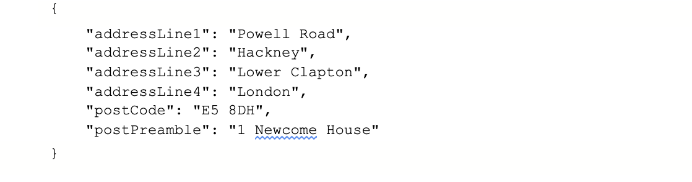

## Purpose
To identify all information to be captured with regards to the Core-Asset domain.

As one of the core entities for all interactions with the council, we understand that the Asset is another entity that had to be brainstormed thoroughly between all three streams (Finance, Tenants & Lease Holders, and Housing) of MTHF. We believe that naming this API as Asset instead of properties will capture other entities which do not necessarily come under properties terminology for eg: facilities such as lifts, booster pumps etc.

As part of our solution, we are proposing to develop the first version of this service as a pilot. This will help to target services more effectively, achieve better outcomes and enhance performance monitoring while reducing cost and risk. This means that we can offer a deeper, more asset-centric self-service capability, enabling even more service transactions to be carried out online.

Our goal is to ensure we build reusable components as part of the MFTH stream and thereby extending to other domains if they need similar information. This will enable us to eliminate the silos mechanism for asset information collection and help us to present a single view on it which will also help us to reduce the future development cost and yield a better ROI.

We have agreed on a flexible approach to following HACT standards for Asset information API as some of our needs are not being met.

## Vision
- A single, centralized data source, holding all core assets data, updated by multiple services.
- A reusable microservice API used for managing that data.
- Single data source to identify all assets related to different domains such as Housing etc to avoid any duplication of data,a normalised view and consistency across the board.

## Our users and their needs

** As a Repairs service user I would like to see the Asset address so that: **
- I can assess the raised repairs information.
- I can find out if the asset belongs the block
- I can find out if the asset belongs to the estate.

** As a Repairs service user I would like to see the information for property reference and major reference so that: **
- I can find the level code(a code which identifies the type of asset whether property or facilities) details.
- I can find if any facilities are linked to the property.
- I can direct the required repairs information to the team.

** As a Repairs service user I would like to see what type of property it is so that: **  
- I can decide what action they can take. For example: if it is a house and the roof is leaking then it will be a house repair similarly if it is a block then it will be a block repair.
- I can find out if the property comes under new build and direct the required team to take action.

** As a Repairs service user I would like to see the tenure type so that: **
- I can associate the required team for the repair responsibilities.
- I can find out if the RTB(Right to buy) flag is set in order to take the required repair request/action.

** As a Tenancy & Leaseholder service user I would like to see the asset information so that: **
- I can find out whether the property is void.
- I can find out if the asset is lettable.
- I can find out the letting patches information of the property.
- I can find out the ward information of the property.
- I can find out the address of the property recorded against the tenure.

** As a Finance service user I would like to see the asset information so that: **
- I can find out whether the property is void.
- I can find out if the asset is lettable.
- I can find out the tenure information of the property.
- I can find out the rent group of the property (HRA information).


** As a Repairs/Tenancy and Leaseholder service user I need to know the LLPG reference so that: **  
- I can identify the location of the property.
- I can see the status of the property (whether the property belongs to a block/estate etc)


** As a consumer I need to have an API specification (e.g. Swagger doc, README), so that: **
- I can have a clear understanding of the endpoints which are available
- I know what the requests and responses should look like
- I need to be able to query for an individual asset record or list of assets so that I can use the information as per the service need in question.

** As a consumer I would like to have the option for paginated results so that: **
- The query duration doesn’t impact the performance of the frontend negatively.
- I can set the page size for large results

** As a housing officer I want to create a new asset so that: **
- The new asset gets validated against uprn(Unique Property Reference Number) field in the address.
- If uprn matches we would throw a validation error "Asset with this uprn already exists".
- If uprn is new we would create new asset.

** As a housing officer I want to update an existing asset so that: **
- The asset information is always up to date.
- I can correct asset information.
- I can change assets status.

** As a developer I need to create an API specification so that: **
- I can provide clear documentation about endpoints and payloads, etc.
- I can help the external agency developer on quick onboarding.

- As a developer I need to be notified when errors occur and have visibility of errors (e.g logs) and issues on the API, so that I can fix them as soon as possible.

- As a developer I need to make sure that access to the API is secure so that only authorised users can make requests to this API.

- As a developer I need to know the structure and content of the entities I am exposing data for, so that I know I am meeting user needs.

- As a developer I need to know which data this API will be concerned with, so that
endpoints are relevant
- I don’t duplicate data provided by other platform APIs


** As an application support analyst**
 I need to understand the queries being used by the API so that I can deal with support requests accordingly and resolve the potential issues in the underlying data.

** As a data analyst I need to connect to the API via Qlik so that: **  
data is easy to interpret and available for further reporting purposes.

** As a data analyst I need to know the LLPG reference so that: **
I can identify the location of the property.
I can see the status of the property (whether the property belongs to a block/estate etc)

# Workshop outcome
## Workshop 1

**Summary**

The workshop was based on identifying different sources that might contribute towards the Asset Information API. We also identified different types of assets based on their classifications and usage and their references in individual MFTH workstreams.

**https://ideaflip.com/edit/d7zfwtixmyhv/zGJtvUcZSq52**

## Workshop 26/04/2022

**Summary**

We covered the need for temporary accomodation assets to have new fields introduced along with a discussion around the relationship between assetTypes hotels/hostels and their children rooms.

Below is the proposal link to all the new fields.

**https://docs.google.com/document/d/1gUub2ye7bnvPO42hc9GqDy2eYCWtR1JRaL78fBKUDv0**

# Questions to ask

** Do we follow HACT standards for Asset Information API. If not, is there any flexibility? **

** We decided not to follow HACT standards in its entirety due to its rigid structure which might meet our user needs. **
## Entities dependent on Asset API
1. Addresses API
2. Notes
3. Tenure
4. Contract
5. Activities
6. Cautionary alerts
7. Lease
8. Repairs (work order)

## Endpoints to be Created:

** Get Properties **

** Purpose: ** Gets one or more properties from the properties table.  Requests can be made by specifying a ref path parameter or searching for properties based on a series of parameters.

Endpoint URLs:

       /assets
       /assets/{prop-ref}
       /assets?llpg-ref={llpg-ref}
       /assets/?postcode=E8 1DY

       Method: GET (list, search, view)
       Request Querystring Parameters:
       postcode - specifies the postcode on which to base the search for requests.
       prop-ref - provides unique property reference
       llpg-ref - provides LLPG reference.
  Request Path Parameter:
  Id - specifies the Id of a specific help request record to return
- Response:
 200
- One or more property


404
If item was not found


2. ** Post Properties **

** Purpose: ** Adds a new asset to the assets table in dynamoDB database.
The new asset gets validated against uprn(Unique Property Reference Number) field in the address.
- If uprn matches we would throw a validation error "Asset with this uprn already exists".
- If uprn is new we would create new asset in the database.

**proposed validations**
uprn - unique
assetId - unique
assetAddress - mandatory
** Endpoint URL: **
assets/

Method: Post
Post object:
```json
{
    "assetId":"string",
    "assetType":"Block",
    "rootAsset":"string",
    "parentAssetIds":"string",
    "assetLocation":{
        "floorNo":"string",
        "totalBlockFloors":0,
        "parentAssets":[
            {
                "type":"string",
                "id":"3fa85f64-5717-4562-b3fc-2c963f66afa6",
                "name":"string"
            }
        ]
    },
    "assetAddress":{
        "uprn":"string",
        "addressLine1":"string",
        "addressLine2":"string",
        "addressLine3":"string",
        "addressLine4":"string",
        "postCode":"string",
        "postPreamble":"string"
    },
    "assetManagement":{
        "agent":"string",
        "areaOfficeName":"string",
        "isCouncilProperty":true,
        "managingOrganisation":"string",
        "managingOrganisationId":"3fa85f64-5717-4562-b3fc-2c963f66afa6",
        "owner":"string",
        "isTMOManaged":true,
        "propertyOccupiedStatus":"string",
        "isNoRepairsMaintenance":true,
        "fundingSource":"string",
        "costCentre":"string",
        "councilTaxType":"string",
        "councilTaxLiability":"string",
        "lhaArea":"string",
        "isTemporaryAccomodation":true,
        "readyToLetDate":true
    },
    "assetCharacteristics":{
        "numberOfBedrooms":0,
        "numberOfLifts":0,
        "numberOfLivingRooms":0,
        "windowType":"string",
        "yearConstructed":"string",
        "assetPropertyFolderLink":"string",
        "epcExpiryDate":"2022-05-17T17:42:12.659Z",
        "fireSafetyCertificateExpiryDate":"2022-05-17T17:42:12.659Z",
        "gasSafetyCertificateExpiryDate":"2022-05-17T17:42:12.659Z",
        "elecCertificateExpiryDate":"2022-05-17T17:42:12.659Z",
        "optionToTax":true,
        "hasStairs":true,
        "numberOfStairs":0,
        "hasRampAccess":true,
        "hasCommunalAreas":true,
        "hasPrivateBathroom":true,
        "numberOfBathrooms":0,
        "bathroomFloor":"string",
        "hasPrivateKitchen":true,
        "numberOfKitchens":0,
        "kitchenfloor":"string",
        "alertSystemExpiryDate":"2022-05-17T17:42:12.659Z",
        "epcScore":"string",
        "numberOfFloors":0,
        "accessibilityComments":"string",
        "numberOfBedSpaces":0,
        "numberOfCots":0,
        "sleepingArrangementNotes":"string",
        "numberOfShowers":0,
        "kitchenNotes":"string",
        "isStepFree":true
    },
    "tenure":{
        "id":"string",
        "paymentReference":"string",
        "type":"string",
        "startOfTenureDate":"2022-05-17T17:42:12.659Z",
        "endOfTenureDate":"2022-05-17T17:42:12.659Z",
        "isActive":true
    }
}
```
Response: 201
Asset created
```json
{
  "id": "3fa85f64-5717-4562-b3fc-2c963f66afa6",
  "assetId": "string",
  "assetType": "Block",
  "rootAsset": "string",
  "parentAssetIds": "string",
  "assetLocation": {
    "floorNo": "string",
    "totalBlockFloors": 0,
    "parentAssets": [
      {
        "type": "string",
        "id": "3fa85f64-5717-4562-b3fc-2c963f66afa6",
        "name": "string"
      }
    ]
  },
  "assetAddress": {
    "uprn": "string",
    "addressLine1": "string",
    "addressLine2": "string",
    "addressLine3": "string",
    "addressLine4": "string",
    "postCode": "string",
    "postPreamble": "string"
  },
  "assetManagement": {
    "agent": "string",
    "areaOfficeName": "string",
    "isCouncilProperty": true,
    "managingOrganisation": "string",
    "managingOrganisationId": "3fa85f64-5717-4562-b3fc-2c963f66afa6",
    "owner": "string",
    "isTMOManaged": true,
    "propertyOccupiedStatus": "string",
    "isNoRepairsMaintenance": true,
    "fundingSource": "string",
    "costCentre": "string",
    "councilTaxType": "string",
    "councilTaxLiability": "string",
    "lhaArea": "string",
    "isTemporaryAccomodation": true,
    "readyToLetDate": true
  },
  "assetCharacteristics": {
    "numberOfBedrooms": 0,
    "numberOfLifts": 0,
    "numberOfLivingRooms": 0,
    "windowType": "string",
    "yearConstructed": "string",
    "assetPropertyFolderLink": "string",
    "epcExpiryDate": "2022-05-17T17:42:12.659Z",
    "fireSafetyCertificateExpiryDate": "2022-05-17T17:42:12.659Z",
    "gasSafetyCertificateExpiryDate": "2022-05-17T17:42:12.659Z",
    "elecCertificateExpiryDate": "2022-05-17T17:42:12.659Z",
    "optionToTax": true,
    "hasStairs": true,
    "numberOfStairs": 0,
    "hasRampAccess": true,
    "hasCommunalAreas": true,
    "hasPrivateBathroom": true,
    "numberOfBathrooms": 0,
    "bathroomFloor": "string",
    "hasPrivateKitchen": true,
    "numberOfKitchens": 0,
    "kitchenfloor": "string",
    "alertSystemExpiryDate": "2022-05-17T17:42:12.659Z",
    "epcScore": "string",
    "numberOfFloors": 0,
    "accessibilityComments": "string",
    "numberOfBedSpaces": 0,
    "numberOfCots": 0,
    "sleepingArrangementNotes": "string",
    "numberOfShowers": 0,
    "kitchenNotes": "string",
    "isStepFree": true
  },
  "tenure": {
    "id": "string",
    "paymentReference": "string",
    "type": "string",
    "startOfTenureDate": "2022-05-17T17:42:12.659Z",
    "endOfTenureDate": "2022-05-17T17:42:12.659Z",
    "isActive": true
  }
}
```

400
Bad request


500
Internal Server Error


3. ** Put Properties **
** Purpose: ** Update a particular asset

Endpoint URL: asset/{id}

Method: Put
Request put object:
Asset object: Json object of the updated asset details e.g.


Response:
204
Asset Updated


404
Not found

       {
       "DevErrorMessages  ": ["validation errors"],
       "UserErrorMessage": "Your item could not be updated for the following  
              reasons..."
       }
500

       Internal Server Error


4. PATCH properties `/assets/{id}`

       ** Purpose: ** Updates an existing asset in dynamoDB database.
       We are using patch to allow for in place editing (single field updates).
    
**Request Payload:**

    ```json
    {
        "assetType": "Garage | Dwelling | Estate ...",
        "assetManagement": {
              "agent": "HAH",
              "areaOfficeName": "Clapton Panel Area Team",
              "isCouncilProperty": false,
              "managingOrganisation": "LBH, -- Hackney or TMO",
              "managingOrganisationId": "6f22e9ae-3e8a-4e0e-af46-db02eb87f8e6",
              "owner": "London Borough of Hackney",
              "isTMOManaged": true,
              "propertyOccupiedStatus" : "Vacant",
              "isNoRepairsMaintenance" : true,
              "fundingSource" : "TA",
              "costCentre" : "D0720",
              "councilTaxType" : "House in multiple occupancy (HMO)",
              "councilTaxLiability" : "Void only",
              "lhaArea" : "Inner East London",
              "isTemporaryAccomodation" : true,
              "readyToLetDate" : true
       },
       "assetCharacteristics": {
              "numberOfBedrooms": "2",
              "numberOfLifts": "1",
              "numberOfLivingRooms": "1",
              "windowType": "DBL",
              "yearConstructed": "1978",
              "assetPropertyFolderLink" : "https://drive.google.com/drive/folders/1Vo7xUYx-wRNR1NTjE4pJGV07DnYirflU",
              "epcExpiryDate" : "31-12-2030",
              "fireSafetyCertificateExpiryDate" : "31-12-2030",
              "gasSafetyCertificateExpiryDate" : "31-12-2030",
              "elecCertificateExpiryDate" : "31-12-2030",
              "optionToTax" : true,
              "hasStairs" : true,
              "numberOfStairs" : 20,
              "hasRampAccess" : true,
              "hasCommunalAreas" : true,
              "hasPrivateBathroom" : true,
              "numberOfBathrooms" : 4,
              "bathroomFloor" : 4,
              "hasPrivateKitchen" : true,
              "numberOfKitchens" : 4,
              "kitchenfloor" : 3,
              "alertSystemExpiryDate" : "31-12-2030",
              "epcScore" : "80 C",
              "numberOfFloors" : 8,
              "accessibilityComments" : "There's a step to get into the shower",
              "numberOfBedSpaces" : 9,
              "numberOfCots" : 12,
              "sleepingArrangementNotes" : "Ground Floor",
              "numberOfShowers" : 4,
              "kitchenNotes" : "Shared, on 1st and 3rd floors",
              "isStepFree" : true
       },
       "rootAsset": "6f22e9ae-3e8a-4e0e-af46-db02eb87f8e6",
    }
    ```
 **Response:**

 Code 200 OK returning the [full payload](#example-full-payload).

## Example full payload
```json
{
       "Id": "6f22e9ae-3e8a-4e0e-af46-db02eb87f8e6",
       "assetId": "00007918",
       "assetType": "Garage | Dwelling | Estate ...",
       "assetLocation": {
              "parentAssets": [
              {
                     "id": "6f22e9ae-3e8a-4e0e-af46-db02eb87f8e6",
                     "type": "sub-block",
                     "name": "Newcombe House (1-18)"
              },
              {
                     "id": "6f22e9ae-3e8a-4e0e-af46-db02eb87f8e6",
                     "type": "block",
                     "name": "Newcombe House (1-35)"
              },
              {
                     "id": "6f22e9ae-3e8a-4e0e-af46-db02eb87f8e6",
                     "type": "estate",
                     "name": "Newcombe House Estate Powell Road"
              }
              ],
              "floor": "G",
              "totalBlockFloors": "5"
       },
       "assetAddress": {
              "uprn": "100021065786",
              "addressLine1": "Powell Road",
              "addressLine2": "Hackney",
              "addressLine3": "London",
              "addressLine4": "",
              "postCode": "E5 8DH",
              "postPreamble": "1 Newcome House"
       },
       "assetManagement": {
              "agent": "HAH",
              "areaOfficeName": "Clapton Panel Area Team",
              "isCouncilProperty": false,
              "managingOrganisation": "LBH, -- Hackney or TMO",
              "managingOrganisationId": "6f22e9ae-3e8a-4e0e-af46-db02eb87f8e6",
              "owner": "London Borough of Hackney",
              "isTMOManaged": true,
              "propertyOccupiedStatus" : "Vacant",
              "isNoRepairsMaintenance" : true,
              "fundingSource" : "TA",
              "costCentre" : "D0720",
              "councilTaxType" : "House in multiple occupancy (HMO)",
              "councilTaxLiability" : "Void only",
              "lhaArea" : "Inner East London",
              "isTemporaryAccomodation" : true,
              "readyToLetDate" : true
       },
       "assetCharacteristics": {
              "numberOfBedrooms": "2",
              "numberOfLifts": "1",
              "numberOfLivingRooms": "1",
              "windowType": "DBL",
              "yearConstructed": "1978",
              "assetPropertyFolderLink" : "https://drive.google.com/drive/folders/1Vo7xUYx-wRNR1NTjE4pJGV07DnYirflU",
              "epcExpiryDate" : "31-12-2030",
              "fireSafetyCertificateExpiryDate" : "31-12-2030",
              "gasSafetyCertificateExpiryDate" : "31-12-2030",
              "elecCertificateExpiryDate" : "31-12-2030",
              "optionToTax" : true,
              "hasStairs" : true,
              "numberOfStairs" : 20,
              "hasRampAccess" : true,
              "hasCommunalAreas" : true,
              "hasPrivateBathroom" : true,
              "numberOfBathrooms" : 4,
              "bathroomFloor" : 4,
              "hasPrivateKitchen" : true,
              "numberOfKitchens" : 4,
              "kitchenfloor" : 3,
              "alertSystemExpiryDate" : "31-12-2030",
              "epcScore" : "80 C",
              "numberOfFloors" : 8,
              "accessibilityComments" : "There's a step to get into the shower",
              "numberOfBedSpaces" : 9,
              "numberOfCots" : 12,
              "sleepingArrangementNotes" : "Ground Floor",
              "numberOfShowers" : 4,
              "kitchenNotes" : "Shared, on 1st and 3rd floors",
              "isStepFree" : true
       },
       "rootAsset": "6f22e9ae-3e8a-4e0e-af46-db02eb87f8e6",
       "parentAssetIds": "6f22e9ae-3e8a-4e0e-af46-db02eb87f8e6#6f22e9ae-3e8a-4e0e-af46-db02eb87f8e6#6f22e9ae-3e8a-4e0e-af46-db02eb87f8e6",
       "Links":  [
              {
                     "Activities":  "https://activitiesapi.hackney.gov.uk/propertyactivities/[propertyId]"
              },
              {
                     "Documents":  "https://documentsapi.hackney.gov.uk?type=property&id=[propertyId]"
              },
              {
                     "EPC Certificate" : "https://assetapi.hackney.gov.uk/epc-cert/[00001111]"
              },
              {
                     "Tenancies": "https://tenanciesapi.hackney.gov.uk/tenancies[propertyId]"
              },
              {
                     "Facilities": "https://assetsapi.hackney.gov.uk/facilities/[00001111]"
              }
       ]
}
```
