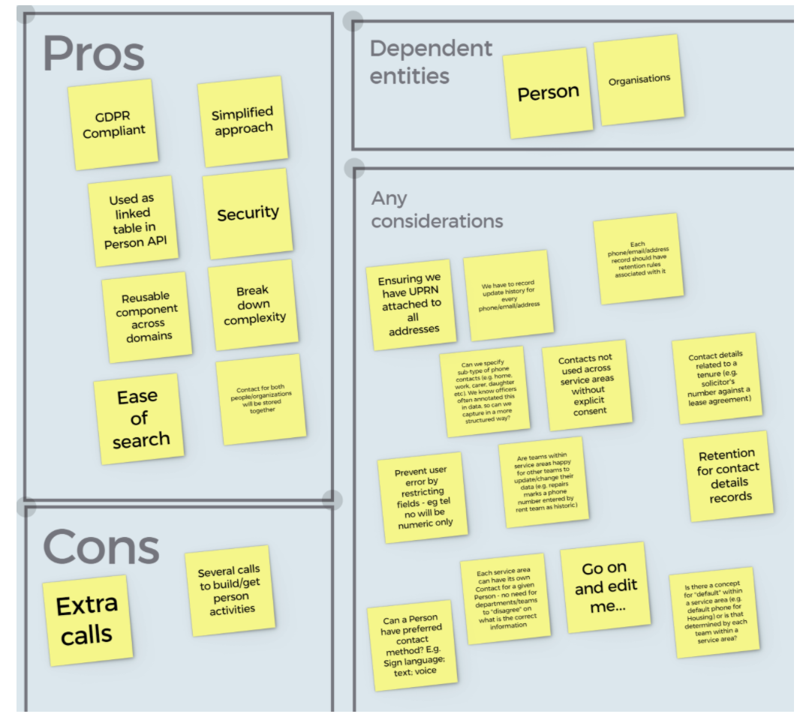

## Purpose

The purpose of this document is to propose the implementation of a Contact Details microservice to interact with contact details data we hold for a person/organization. In the initial implementation, the microservice will focus on the Housing domain, but it should be built in a reusable way so it can be extended to other service areas in the future.  

- Contact details can be related to a person/organization and include one or multiple (both historical and current)
- email address
- phone numbers
- correspondence address/es (if any)
- forwarding addresses (if any)

** Note: **  A contact detail (e.g. phone number or forwarding address), might be different for a person depending on the service area it is used for. For example, a person might have provided a specific phone number to be used by Social care for contacting them, and a different one to Housing.
This means that we do not have the concept of ‘default’ phone/email/address overall. There could be a default one per service area.
We cannot be sharing contact details to be used by different service areas, unless an explicit consent has been provided (currently no mechanism to capture this, it involves a complex process and has been deprioritized).

The above is important to be considered as this microservice should be built in a way to be reused by multiple service areas and security around data sharing should be included in the design.

## Vision
- A single, centralized data source, holding contact details data for a person/organization, updated by multiple services.
- A reusable microservice API used for managing that data.
- Avoidance of any duplication of data, a normalised view and consistency across the board.

## Data meetup outcome (30/03/2021)

https://ideaflip.com/b/bk558iy45tyt/

## Considerations

- When we record addresses, if they are UK addresses, we should record the UPRN
- Sub-type of a contact detail should help us capture data in a more structured manner (previously there were issues with data quality - e.g. a phone number value will be “0791121212121 - Daughter “)
- Contact details should not be used across different service areas without explicit consent.
- Contact details can be against other entities - for example, we should be able to record a phone number of a solicitor against a lease agreement (tenure)
- Restricting fields data type - e.g. phone numbers should only allow numbers
- Data entity to be designed in a generic way so it can be used for other use cases - e.g. different type of contact addresses Social care uses

## Questions
- Do we have the concept of default number within a service area, or does this need to be done down to individual teams level?
- Are teams within the same service area happy to mark a number as ‘historic’ that another team might be using?
- Should we record preferred contact method?

## Our User and their needs

 ** As a service user I want to see: **
- The contact phone number(s) for informed communication.
- History of correspondence addresses
- Forwarding addresses for future correspondence
- Email address(es) for informed communication.
- Endpoints to be created
- GET /contact-details/{id} //will we ever have a use case to retrieve a single contact details record?
- GET /contact-details?targetId={id}&includeHistoric=true //id of person/organization to retrieve all contact details, with optional filtering of whether historic details should be included. Default should be false.
- POST /contact-details
- Inserts a new contact details record
- PUT /contact-details/{id}
- Updates a contact details record.
- In previous use cases, value of record was not updated - e.g. if a new phone number is created, a new record was added and old record was marked as inactive if applicable
- Fields that should be updatable -
active
- isDefault (under sourceServiceArea)
description (under contactInformation)

## Dependent Entities
1. Person
2. Organization

## Api Endpoints
- Get contact details by id
- Create new contact details
- Soft delete contact details

## Example payload

https://app.swaggerhub.com/apis-docs/Hackney/contactDetailsApi/1.0.0

## Governance around Contact Details Data

https://docs.google.com/document/d/124t3pPXvNaZ5VVo_SUXJeh6JTM5pchAVTnpIv2MXuno/edit#heading=h.bpe1osq9adg2
