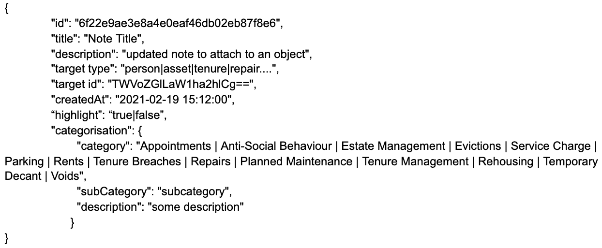
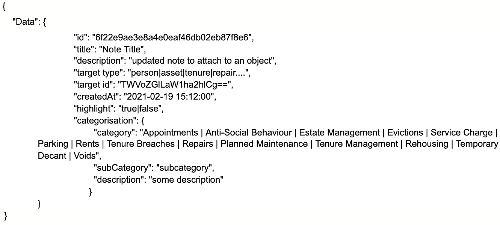

## Purpose
To identify all information to be captured with regards to the Notes domain.

As we think that the Notes can be used as a reusable component between all three streams (Finance, Tenants & Leaseholders,Repairs) of MTHF and possibly other datasets as well as it is only meant to create and retrieve all activities against the entity in need.

As part of our solution, we are proposing to develop the first version of this API as a pilot. This will help to target services more effectively, achieve better outcomes and enhance performance monitoring while reducing cost and risk. This means that we can offer a deeper, more self-service capability, enabling even more service transactions to be carried out online.

Our goal is to ensure we build reusable components as part of the MFTH stream and thereby extending to other domains if they need similar information. This will enable us to eliminate the silos mechanism for asset information collection and help us to present a single view on it which will also help us to reduce the future development cost and yield a better ROI.By building a single source of truth of core information such as Notes with reusable microservice APIs on top of them used for managing that data as it eliminates the scope of duplication of data and main drive to promote reusability.In other words this indicates to have a strong API technology model which drives the aim of setting a central API management platform.

We are also proposing further classification of Notes as private and public notes. This will enable us to offer more transparency in communications to our residents who will be using the online services via public notes. The private notes will be secured with restricted access to the officers who are entitled to view the notes.

## Vision

- A single, centralized data source, holding all core notes data, updated by multiple services from different datasets.
- A reusable microservice API used for managing notes data.
- Single data source to identify all notes related to different domains such as Housing etc to avoid any duplication of data,a normalised view and consistency across the board.

## Our users and their needs

** As a service user I would like to see the Notes so that **
- I have detailed heading to understand what the notes is about
- I am aware of the timestamp
- I need to know the author of a note
- I have latest notes at the top
- I have grouping notes
- I can use documents attached to the record for more detail (detail can be provided of where the document is stored)

** As a consumer I need to have an API specification (e.g. Swagger doc, README), so that **
- I can have a clear understanding of the endpoints which are available
- I know what the requests and responses should look like

As a consumer I need to be able to query for an individual notes record or list notes records so that I can use the information as per the service needed in question.

** As a consumer I would like to have the option for paginated results so that **
- The query duration doesn’t impact the performance of the frontend negatively.
- I can set the page size for large results

** As a developer I need to create an API specification so that **
- I can provide clear documentation about endpoints and payloads, etc.
- I need to be notified when errors occur and have visibility of errors (e.g logs) and issues on the API, so that I can fix them as soon as possible.
-  I need to make sure that access to the API is secure so that only authorised users can make requests to this API.
-  I need to know the structure and content of the entities I am exposing data for, so that I know I am meeting user needs.
-  I need to know which data this API will be concerned with, so that
endpoints are relevant
- I don’t duplicate data provided by other platform APIs

** As an application  support analyst **
 - I need to understand the queries being used by the API so that I can deal with support requests accordingly and resolve the potential issues in the underlying data.

** As a data analyst I need to connect to the API via Qlik so that **
- Data is easy to interpret and available for further reporting purposes.

# Workshop outcome

## Workshop 1

** Summary **

The workshop was based on identifying different sources that might contribute towards the Notes API. As the notes are currently being used from one dimensional perspective and are not reusable for other related services.

https://ideaflip.com/edit/uhe2bvdkm8fj/3TqQ2hqBlWef

** Benefits of centralised Notes repository **

- Standardised notes model
- Single view of notes
- Better governance

## Endpoints to be created

** Get Notes **
** Purpose: ** Gets one or more properties from the properties table.  Requests can be made by specifying a ref path parameter or searching for properties based on a series of parameters.

      

404
If item was not found

                {
                  “devErrorMessages”: [“debug info or stack trace”],
                  “userErrorMessage”: “The item you search for was not found”
                }

** Post Note **
Purpose: Creates one or more notes.
Endpoint URL: notes/

Method: Post
Request post object:
- Notes object: Json object of the notes details e.g.

Response:
201
Note created

400
Bad request

500
Internal Server Error

** Put Note **
** Purpose: ** Update a particular note

Endpoint URL: notes/{id}

Method: Put
Request put object:
Notes object: Json object of the notes details e.g.

Response:
204
Note Updated

404
Not found

500
Internal Server Error

** Delete Note **
** Purpose: ** Delete a particular note

Endpoint URL: notes/{id}

Method: Delete

Response:
202
Note Deleted

500
Internal Server Error

## Example payload

                            "id": "6f22e9ae3e8a4e0eaf46db02eb87f8e6",
                            "description": "some notes to attach to an object",
                            "target type": "person|asset|tenure|repair....",
                            "target id": "TWVoZGlLaW1ha2hlCg==",
                            "datetime": "2021-02-19 15:12:00",

                            "attachments": [
                            {
                            "id": "adac35e4fe5c427f83c56417dbfbf2da",
                            "title": "document 1",
                            "description": "document 1 provided for reason X",
                            "type?": "Identification",
                            "uri": "https://aws.com/document1.pdf", //documents microservice uri
                            "valid up to datetime": "2021-08-19 15:12:00"
                            }
                            ],

                            //do we need a categorisation ?
                            "Categorisation": {
                            "category": "cat1",
                            "sub category": "subcat1",
                            "description": "some description"
                            },

                            "Author": {
                            "id": "TWVoZGlLaW1ha2hlCg==",
                            "full name": "Mehdi Kimakhe",
                            "email": "mehdi.kimakhe@hackney.gov.uk"
                            },

                            	“tags” : [
                            		"person",
                            "update",
                            "complaint"
                            	]
                            }
