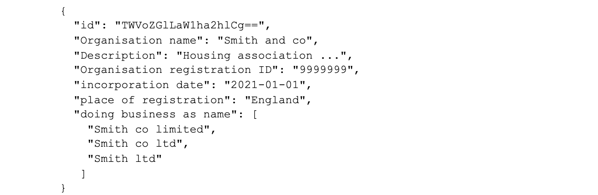
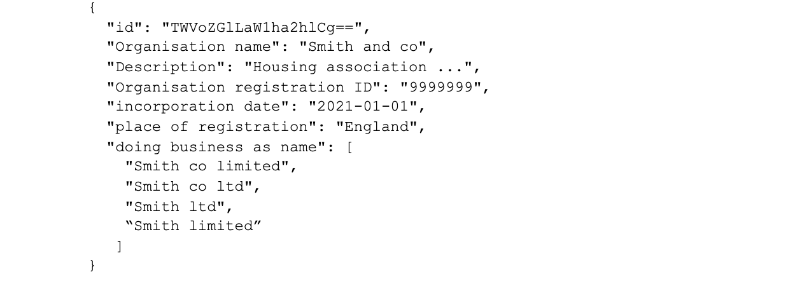

## Purpose

Currently UH does not have a process to identify the corporate accounts/organisations accounts from a person record. To keep the structure clean and maintainable for future purpose and also beneficial for maintaining the business index records, we have agreed to create an API which will flag if the record is a corporate account.

As part of our solution, we are proposing to develop the first version of this service as a pilot. This will help to target services more effectively, achieve better outcomes and enhance performance monitoring while reducing cost and risk.

Our goal is to ensure we build reusable components as part of the MTFH stream and thereby extending to other domains if they need similar information. This will enable us to eliminate the silos mechanism for asset information collection and help us to present a single view on it which will also help us to reduce the future development cost and yield a better ROI.

## Vision
- A single, centralised data source, holding all core organisations data, updated by multiple services.
- A reusable microservice API used for managing that data.
- Single data source to help us achieve consistency in data structure related to person’s data and remove duplication of resident data we hold.
- Reducing development efforts
- Easy to search.

## Our users and their needs

** As a service user I need corporate account information so that: **
- I can determine if the tenancy is person based or business.
- Find contact details for communication
- I can decide any arrears action which may need to take place
- I can determine if the same organisation have a number of properties with relevant details
- I can view Certificate of Incorporation details which provides company number so you can view all important information
- I can view a list of directors
- I can view details about registered office location.
- I can view the documents attached to the account.

** As a consumer I need to have an API specification (e.g. Swagger doc, README), so that: **
- I can have a clear understanding of the endpoints which are available
- I know what the requests and responses should look like
-  I need to be able to query for an individual organisation record or list of organisations so that I can use the information as per the service needed in question.

** As a consumer I would like to have the option for paginated results so that: **
- The query duration doesn’t impact the performance of the frontend negatively.
- I can set the page size for large results

** As a developer, I want to: **
- Built and reuse a single Organisations API microservice so that development efforts can be focused on other requirements
- Ensure data updated, retrieved and inserted is consistent across services and reliable
- Have an easy way to retrieve any data related to a Organisations so that I don’t need to make additional calls to find references for related systems

** As a developer I need to create an API specification so that: **
-  I can provide clear documentation about endpoints and payloads, etc.
-  I can help the external agency developer on quick onboarding.
-  I need to be notified when errors occur and have visibility of errors (e.g logs) and issues on the API, so that I can fix them as soon as possible.
-  I need to make sure that access to the API is secure so that only authorised users can make requests to this API.
-  I need to know the structure and content of the entities I am exposing data for, so that I know I am meeting user needs.
-  I need to know which data this API will be concerned with, so that
endpoints are relevant
- I don’t duplicate data provided by other platform APIs

** As an application support analyst **
- I need to understand the queries being used by the API so that I can deal with support requests accordingly and resolve the potential issues in the underlying data.

** As a data analyst I need to connect to the API via Qlik so that:  **
- Data is easy to interpret and available for further reporting purposes.

## Entities dependent on Organisations API
1. Persons
2. Tenure

## Endpoints

** Get Endpoint **

** Purpose: ** Get One or more organisation from the corporate account/organisation accounts table.  Requests can be made by specifying a ref path parameter or searching for properties based on a series of parameters.

Endpoint URL:
                    organisations/
                    organisations/{id}
                    organisations/?organisationName=”Smith and co”

Request Querystring Parameters:
Organisations Name
Request Path Parameter:
Id - specifies the Id of a specific help request record to return
Response:
200
One or more help requests

404
If item was not found

** Post Endpoint: **
Purpose: Create a new organisation/corporate account
Endpoint URL:
  - organisations/
Request post object:
- Organisation object: json object of the organisation details e.g.

Response:
- 201
- Organisation account created

400
Bad request

500
Internal Server Error

** Patch Endpoint: **
** Purpose: ** Update organisation account details

Endpoint URL:
- organisations/{id}
- Method: Put
- Request put object:
- Organisation object: Json object of the organisation details e.g.

Response:
  204
  Organisation Updated

404
 Not found

500
Internal Server Error

## Payload

Organisations data model created by Medhi (Amido):

https://docs.google.com/document/d/1OWD0_PFaN6gCMjN2qX4Ck7xgTykiu-7Q6vBnZPENjDw/edit?usp=sharing

- Trading name
- Name
- Short name

Swagger Page:
https://app.swaggerhub.com/apis/Hackney/organisationsApi/1.0.0

** Meeting Notes **
- Corporate property services - using spreadsheet for source data
- Types of services:
- Schools
- Community assets/halls
- Open spaces
- Organisation lettings
- Communication lettings
