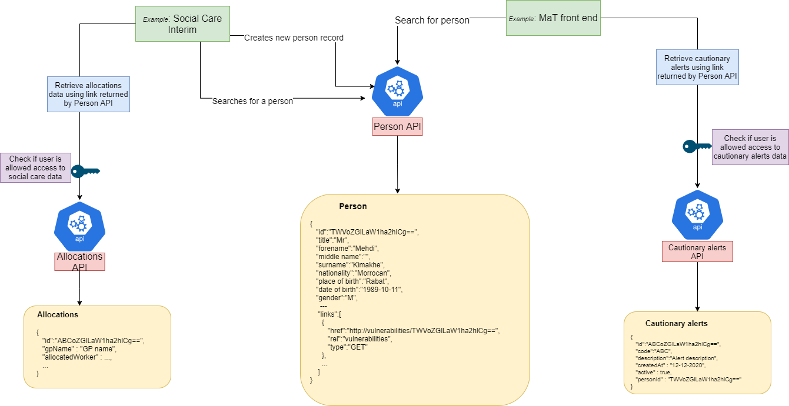

## Purpose:
To identify all information to be captured with regards to the Core Person domain.

As one of the core entities for all interactions with the council, we understand that the Person entity had to be brainstormed thoroughly between all three streams of MFTH( as the starting point of conversation for a single view for person related data).

This will be the core platform API to be used by other areas within the housing domain for the current needs, however with the scope of extending this to other datasets. With no Citizens Index in place due to the cyber-attack, we will be posed with the question of a single view of all resident information and their interactions with the council. Also, it will enable Hackney to conduct resident profiling to improve the services the council offers so good that people prefer to use them all the time.

As part of our solution we are proposing for a housing stream to develop the first version of this service as a pilot. This will help to target services more effectively, achieve better outcomes and enhance performance monitoring while reducing cost and risk. This means that we can offer a deeper, more citizen-centric self-service capability, enabling even more service transactions to be carried out online.

Our goal is for this solution to be implemented in MFTH and gradually extended to other domains. The current silos of citizen data make this a very difficult and time-consuming challenge to overcome. As the user needs for all services are similar in terms of resident domain lookup, we end up having longer development cycles and strongly coupled services that cannot be reused for similar needs in other domain services. Due to this, residents do not get the right support at the right time and the data cleansing process becomes ever so difficult.

Having a single person domain will enable us to remove the silos mechanism for resident information collection and help us to present a single and updated view on the resident which means less development cost and better ROI in future. Also, it will help the contact centre in better and informed decision making for managing the ongoing service demands.

## Vision
- A single, centralized data source, holding all core persons data, updated by multiple services.
- A reusable microservice API used for managing that data.
- Single data source to help us achieve consistency in data structure related to person’s data and remove duplication of resident data we hold.
- Reducing development efforts
- Flexibility to store ‘extended’ data, related to a person, that might be sensitive and only accessible by a single service area
- A future goal of all services dealing with residents (and other types of contacts) interacting with a single data source, which will improve:
    - Staff experience - if we already have a record of a person, they don’t need to create a new one
    - Residents experience - do not need to provide us with data more than once
- Remove the need for the difficult task of data matching in the future (where multiple records of the same person across systems need to be matched) as all data will be saved in the same location

## Our users and their needs

** As a service user I would like to see the resident information so that: **
- I can make an informed decision with regards to the resident query I am dealing with.
- I have the basic information about the council tenant when a house visit is made.
- I can identify the resident who has reported for the repair.
- I can perform my tasks - creating tenancy management processes, raising notes and alerts and more

** As a service user, I would like: **
- To search for people and know if they have already interacted with the council
- Search and update existing records of people, instead of creating new ones
- An easy way to find out information about a person so that I don’t have to search multiple systems in order to find details about the same person recorded by separate systems

** As a consumer of this API I would like to see: **
- The name of the person so that this data is available for any housing service (at present) that requires it.
- The nationality of the person so that this data is available to any service that requires it.
- The gender of the person so that this data is available for any service that requires it.
- The ethnic origin of the person, so that I have this data available for any service that requires it.
- The title of the person, so that I have this data available for any service that requires it.
- The DOB of the person so that I have this data available for any service that requires it.
- The cross references to other microservices so that I can retrieve any related data if necessary

** As a developer, I want to: **
- built and reuse a single Person API microservice so that development efforts can be focused on other requirements
- Ensure data updated, retrieved and inserted is consistent across services and reliable
- Have an easy way to retrieve any data related to a person so that I don’t need to make additional calls to find references for related systems

** As an application  support analyst **
-  I need to understand the queries being used by the API so that I can deal with support requests accordingly and resolve the potential issues in the underlying data,

** As a data analyst**
-  I need to connect to the API via Qlik so that data is easy to interpret and available for further reporting purpose.and analysis.

## Workshop outcome
### Workshop 1 & 2

**Summary**
Our first workshop started looking at the various domains that we expect would have requirements for person information.  This includes contacts for Residents, Landlords, TMOs, etc and the various services that may require contact such as finance, repairs, tenancy & leaseholding, etc.Identifying these sources was crucial along with different types of contacts and how do they relate to each of the MFTH workstream.

https://ideaflip.com/b/kna94c7d6vg6/

### Workshop 3:

**Summary**
The third workshop re-focused on identifying areas (domains) that depend on person data. Those include cautionary alerts, activities, notes, patches, vulnerabilities, housing register applications, etc. and established the concept of a core contact entity.  We’ve agreed that the core contact entity will maintain and return cross references to other services. We discussed what properties the core contact entity may contain.

https://ideaflip.com/b/tk5mzrgytdri/
### Entities dependent on Person API.

1. Cautionary Alerts
2. Vulnerabilities
3. Addresses
4. Properties
5. Notes
6. Patches/areas
7. Tenure
8. Activities
9. Universal credit
10. Housing register applications
11. Homelessness cases (TAPL)?
12. Communication details

### Endpoints to be created for core person microservice

1. GET **/persons/?**

    a. Query parameters:

        i.      First name
        ii.     Last name
        iii.    Address?
        iv.     Date of Birth
        v.      NI?
2. GET **/persons/{person-id}**
3. PATCH **/persons/{person-id}**
4. POST **/persons/{person-id}**


Proposed Data Model by Amido:

https://docs.google.com/document/d/1DjZiUw8yzN3OxlQOudtiSdwbG84coGKI8eYIWJv-o8g/edit
HackIT proposal for Person data model based on the model proposed by Amido.

**Example payload**
```
{
    "id": "TWVoZGlLaW1ha2hlCg==",
    "title": "Mr",
    "forename": "Mehdi",
    "Preferred forename": "Mehdi",
    "middle name": "",
    "surname": "Kimakhe",
    "Preferred surname": "Kimakhe",
    "nationality": "Morrocan",
    "place of birth": "Rabat",
    "date of birth": "1989-10-11",
    "gender": "M",
    "identification": [
        {
            "type": "NI",
            "value": "1234A",
            "Original Document Seen": false,
            ‘Link to document’: ‘link’
        },
        {
            "type": "passport",
            "value": "A11111",
            "Original Document Seen": true
        }
    ],
    "languages": [
        {
            "language": "French",
            "is primary": false
        },
        {
            "language": "English",
            "is primary": true
        }
    ],
    "communication": [
        {
            "channel": "email",
            "value": "mehdi.kimakhe@hackney.gov.uk"
        },
        {
            "channel": "phone",
            "value": "07000000000"
        }
    ],
    "communication requirements": [
        "sign language",
        "interpreter needed"
    ],

    "links": [
            {
                "href": "http://vulnerabilities/TWVoZGlLaW1ha2hlCg==",
                "rel": "vulnerabilities",
                "type" : "GET"
            },
            {
                "href": "http://activities/TWVoZGlLaW1ha2hlCg==",
                "rel": "activities",
                "type" : "GET"
            },
            {
                "href": "http://socialcare/TWVoZGlLaW1ha2hlCg==",
                "rel": "socialcare",
                "type" : "GET"
            },
            {
                "href": "http://tenure/TWVoZGlLaW1ha2hlCg==",
                "rel": "tenure",
                "type" : "GET"
            },
            {
                "href": "http://notes/TWVoZGlLaW1ha2hlCg==",
                "rel": "notes",
                "type" : "GET"
            },
            {
                "href": "http://cautionarycontact/TWVoZGlLaW1ha2hlCg==",
                "rel": "cautionarycontact",
                "type" : "GET"
            },
            {
                "href": "http://correspondenceaddresses/TWVoZGlLaW1ha2hlCg==",
                "rel": "correspondenceaddresses",
                "type" : "GET"
            },
    etc…...

    ]

}
```

**Core person API microservice: Nice to have**

- A way to deliver the links based on what a user is allowed to link to or what is available (eg if a service is down the link doesn’t get returned).  This would add a layer of complexity to the API but would make the front end implementation easier.

- Links would be built using a cross-references table

### Architecture Diagram

