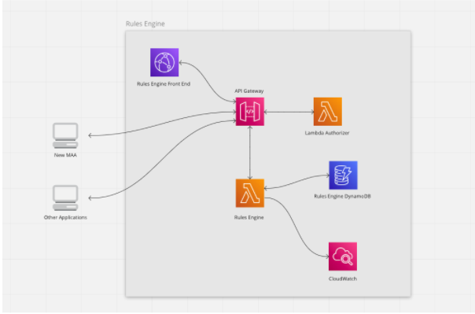

## Purpose

To provide a generic service for managing business rules as a reusable service. This service will act as a repository for business rules normally hardcoded into an application and provide a more flexible approach for managing these rules.
This service is designed to decouple business rules from applications and have a common source of rules for multiple services.

## Functions

- Record application rules as a separate service and abstracted away from applications to increase visibility of these rules.
- Allow business users to easily manage business rules used in an application.
- Improve flexibility of an application by extracting business rules management.

## Vision

- A single, centralised data source holding all business rules which can be updated by multiple services.
- A reusable microservices API for managing business rules.
- Reducing development cost and time.
- A decoupled architecture that allows this entity to be reused across multiple services.

## User needs

- As a business user I would like to be able to see the business rules of an application so that I can make changes to the rules as services and/or legislation change.
- As a developer or SME I would like to be able to manage business rules outside of the application so I can make changes to these rules without having to update the application’s code base.
- As a manager I would like to know the history of business rules changes so that I know which rules applied at a particular given time.

## Architecture



## Workshop outcome

TBC

## API Endpoints:

#### Get workflow list request

```
GET /workflow
```

#### Response payload

```
[
  {
    "id": "3fa85f64-5717-4562-b3fc-2c963f66afa6",
    "workflowName": "string",
    "rules": [
    {
      "ruleName": "string",
      "operator": "string",
      "errorMessage": "string",
      "enabled": true,
      "ruleExpressionType": 0,
      "rules": [],
      "expression": "string",
      "successEvent": "string"
    }
  ],
    "createdAt": "2022-02-18T21:09:17.388Z",
    "lastUpdatedAt": "2022-02-18T21:09:17.388Z"
  }
]
```

#### Get single workflow request

```
GET /workflow/{workflowName}
```

#### Response payload

```
{
  "id": "3fa85f64-5717-4562-b3fc-2c963f66afa6",
  "workflowName": "string",
  "rules": [
    {
      "ruleName": "string",
      "operator": "string",
      "errorMessage": "string",
      "enabled": true,
      "ruleExpressionType": 0,
      "rules": [],
      "expression": "string",
      "successEvent": "string"
    }
  ],
    "createdAt": "2022-02-18T21:04:47.013Z",
    "lastUpdatedAt": "2022-02-18T21:04:47.013Z"
}
```

#### Post workflow request

```
POST /workflow
```

#### Request payload

```
{
  "workflowName": "string",
  "rules": [
  {
    "ruleName": "string",
    "operator": "string",
    "errorMessage": "string",
    "enabled": true,
    "ruleExpressionType": 0,
    "rules": [],
    "expression": "string",
    "successEvent": "string"
  }
  ]
}
```

#### Response payload

```
{
  "id": "3fa85f64-5717-4562-b3fc-2c963f66afa6",
  "workflowName": "string",
  "rules": [
    {
      "ruleName": "string",
      "operator": "string",
      "errorMessage": "string",
      "enabled": true,
      "ruleExpressionType": 0,
      "rules": [],
      "expression": "string",
      "successEvent": "string"
    }
  ],
  "createdAt": "2022-02-18T21:11:05.432Z",
  "lastUpdatedAt": "2022-02-18T21:11:05.432Z"
}
```

#### Patch workflow request

```
PATCH /workflow/{workflowName}
```

#### Request payload

```
[
  {
    "ruleName": "string",
    "operator": "string",
    "errorMessage": "string",
    "enabled": true,
    "ruleExpressionType": 0,
    "rules": [],
    "expression": "string",
    "successEvent": "string"
  }
]
```

#### Response payload

```
{
  "id": "3fa85f64-5717-4562-b3fc-2c963f66afa6",
  "workflowName": "string",
  "rules": [
    {
      "ruleName": "string",
      "operator": "string",
      "errorMessage": "string",
      "enabled": true,
      "ruleExpressionType": 0,
      "rules": [],
      "expression": "string",
      "successEvent": "string"
    }
  ],
  "createdAt": "2022-02-18T21:15:00.809Z",
  "lastUpdatedAt": "2022-02-18T21:15:00.809Z"
}
```

#### Post rule execution request

```
POST /rule/execute
```

#### Request payload

```
[
  {
    "inputRuleName": "string",
    "parameters": {
      "additionalProp1": {},
      "additionalProp2": {},
      "additionalProp3": {}
    }
  }
]
```

#### Response payload

```
{
  "rule": {
    "ruleName": "string",
    "operator": "string",
    "errorMessage": "string",
    "enabled": true,
    "ruleExpressionType": 0,
    "rules": [],
    "expression": "string",
    "successEvent": "string"
  },
  "isSuccess": true,
  "exceptionMessage": "string"
}
```
