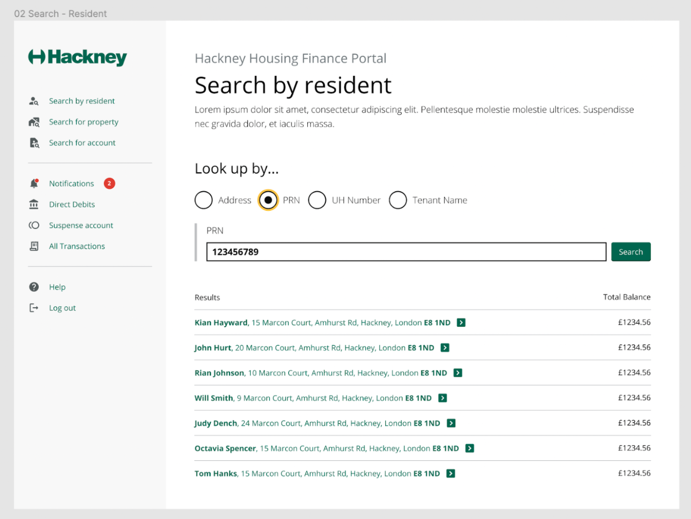
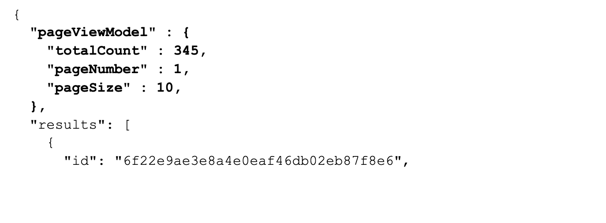
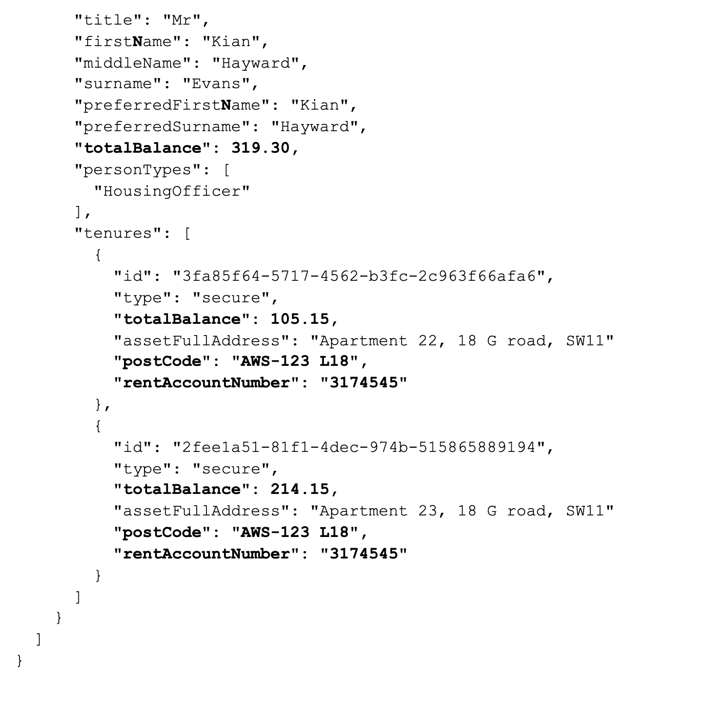
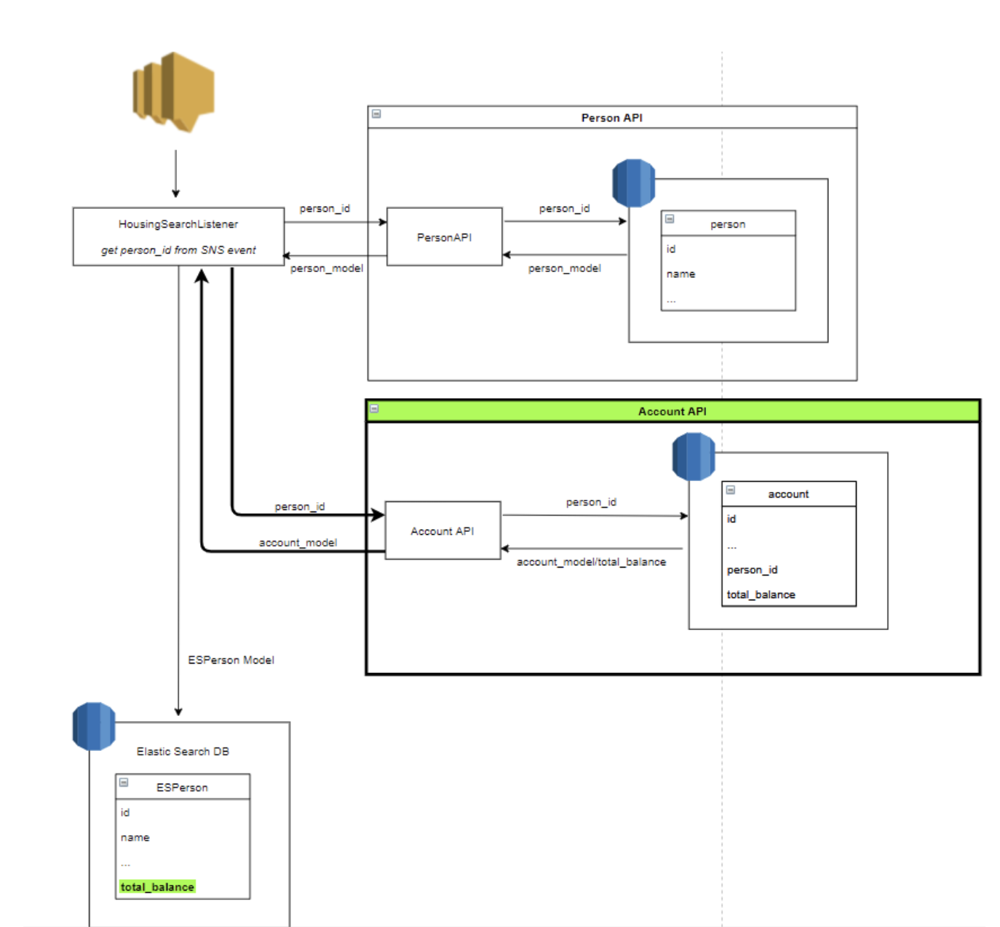

## Purpose

As part of our solution, we are proposing to develop the first version of this service as a pilot. This will help to target services more effectively, achieve better outcomes and enhance performance monitoring while reducing cost and risk.
This means that we can offer a deeper, more asset-centric self-service capability, enabling even more service transactions to be carried out online.

Our goal is to ensure we build reusable components as part of the MFTH stream and thereby extending to other domains if they need similar information.

This will enable us to eliminate the silos mechanism for asset information collection and help us to present a single view on it which will also help us to reduce the future development cost and yield a better ROI.
We are considering using ElasticSearch as our search engine. Our elastic search cluster will be hosted on AWS Elastic search Service.

## Vision

- A single, centralised data source, holding all core assets data, updated by multiple services.
- A reusable micro-service API used for managing that data.
- Single data source to identify all assets related to different domains such as Housing etc to avoid any duplication of data, a normalised view and consistency across the board.

## Our users and their needs

** As a Repairs service user I would like to see the Asset address so that: **

- I can assess the raised repairs information.
- I can find out if the asset belongs the block
- I can find out if the asset belongs to the estate.

** As a Repairs service user I would like to see the information for property reference and major reference so that: **

- I can find the level code(a code which identifies the type of asset whether property or facilities) details.
- I can find if any facilities are linked to the property.
- I can direct the required repairs information to the team.

** As a Repairs service user I would like to see what type of property it is so that: **  

- I can decide what action they can take. For ex: if it is a house and roof is taking then it will be a house repair similarly if it is a block then it will be a block repair.
- I can find out if the property comes under new build and direct the required team to take action.

** As a Repairs service user I would like to see the tenure type so that: **

- I can associate the required team for the repair responsibilities.
- I can find out if the RTB(Right to buy) flag is set in order to take the required repair request/action.

** As a Tenancy & Leaseholder service user I would like to search for person information so that: **

- I can view contact details to communicate with Hackney residents.
- I can view personal details to make informed decisions .
- I can view tenure details

** As a Tenancy & Leaseholder service user I would like to search for tenure information so that: **

- I can see important information related to the tenure
- I can view the named tenure holders and household members
- I can access the person records associated with a tenure
- I can edit a tenure

** As a Finance service user I would like to see the asset information so that: **

- I can find out whether the property is void.
- I can find out if the asset is lettable.
- I can find out the tenure information of the property.
- I can find out the rent group of the property (HRA information).

** Additional Information **

- As a Finance service user, when I search by a Resident, I would like to get a list of all the Tenancies along with Person details (tenure info and total balance)
- When I search by PRN
- When I search by UH Number
- When I search by Address
- When I search by Tenant’s name

** As a Finance service user, when I search by a Resident using Address, I would like to: **

- Get a list of all the blocks and the properties inside if the postcode belongs to a block along with the Person’s details, tenancy address and the total balance
- Get a list of all the Estates and the blocks and the properties inside if the address belongs to an Estate along with the Person’s details, tenancy address and the total balance

** As a Finance service user, when I search by a Resident using UH Number, PRN or Tenant’s name, I would like to: **

- Get a list of all the Tenancies belonging to the person along with the Total Balance and the Rent Account Number

** As a Finance service user, when I search by Property, I would like to search using following parameters: **
- Address
- PRN
- Estate
- UH Number
- Tenant Name

** As a Finance service user, when I search by Property using Address, I would like to get: **

- If the address belongs to an Estate then a list of Blocks and the properties along with a Total balance
- If the address belongs to a Block then a list of all the properties inside the Block along with a Total Balance
- If the address belongs to a single property, then just bring up a single property along with a Total balance

** As a Finance service user, when I search by Property using Estate, I would like to get: **

- List of all the Estates along with other information
- Total Dwelling Rent
- Total Non-Dwelling Rent
- Total Service Charges
- Total Rental Service Charges

** As a Repairs/Tenancy and Leaseholder service user I need to know the LLPG reference so that: **

- I can identify the location of the property.
- I can see the status of the property (whether the property belongs to a block/estate etc)

** As a consumer I need to have an API specification (e.g. Swagger doc, README), so that: **

- I can have a clear understanding of the endpoints which are available
- I know what the requests and responses should look like

** As a consumer: **
-  I need to be able to query for an individual asset record or list of assets so that I can use the information as per the service need in question.

** As a consumer I would like to have the option for paginated results so that: **

- The query duration doesn’t impact the performance of the frontend negatively.
- I can set the page size for large results

** As a developer I need to create an API specification so that: **

- I can provide clear documentation about endpoints and payloads, etc.
- I can help the external agency developer on quick onboarding.

** As a developer I need to be notified when errors occur and have visibility of errors (e.g logs) and issues on the API, so that: **

-  I can fix them as soon as possible
-  I need to make sure that access to the API is secure so that only authorised users can make requests to this API.
-  I need to know the structure and content of the entities I am exposing data for, so that I know I am meeting user needs.
-  I need to know which data this API will be concerned with, so that
endpoints are relevant
-  I don’t duplicate data provided by other platform APIs

** As an application  support analyst **

- I need to understand the queries being used by the API so that I can deal with support requests accordingly and resolve the potential issues in the underlying data.

** As a data analyst I need to connect to the API via Qlik so that: **
- Data is easy to interpret and available for further reporting purposes.

** As a data analyst I need to know the LLPG reference so that: **

- I can identify the location of the property.
- I can see the status of the property (whether the property belongs to a block/estate etc)

# Workshop outcome

## Workshop 1

** Summary **

The workshop was based on identifying different sources that might contribute towards the Asset Information API. We also identified different types of assets based on their classifications and usage and their references in individual MFTH workstreams.

https://ideaflip.com/edit/d7zfwtixmyhv/zGJtvUcZSq52

## Questions to ask

Do we follow HACT standards for Asset Information API. If not, is there any flexibility?

We decided not to follow HACT standards in its entirety due to its rigid structure which might meet our user needs.
Entities dependent on Search API.
- Addresses API
- Notes
- Tenure
- Contract
- Activities
- Cautionary alerts
- Lease
- Repairs (work order)

**  Endpoints **

GET /search/persons- retrieve person record through the use of simple search and the following query parameters for pagination:
- searchText
- pageSize
- Page
- sortBy
- isDesc

**  Responses **

- 200 - Successfully retrieved person details upon request
- 404 - searched Person not found

GET /search/assets?addressText - retrieve asset record through the use of simple search based on the addressText provided and the following query parameters for pagination:
- searchText
- pageSize
- Page
- sortBy
- isDesc

	** Responses: **

- 200 - Successfully retrieved asset details upon request
- 404 - searched asset not found

GET /search/tenures?searchText - retrieve tenure record through the use of simple search based on the searchText provided and the following query parameters for pagination:
searchText
- pageSize
- Page
- sortBy
- isDesc

** 	Responses: **
- 200 - Successfully retrieved tenure details upon request
- 404 - searched tenure not found

GET /search/transactions?[searchText]OR[targetId] - to get paginated transactions list by search text and the following query parameters for pagination:
- searchText
- pageSize
- Page
- Startdate - DateTime, optional
- endDate - DateTime, optional
- isSuspense - bool, optional. Default value is false

** 	Responses: **
- 200 - Successfully retrieved tenure details upon request
- 500 - Internal server error 

## Example payload

https://app.swaggerhub.com/apis/Hackney/housingSearchApi/1.0.0#/

** Payload for search person **

                  {
                    "results": [
                      {
                        "id": "6f22e9ae3e8a4e0eaf46db02eb87f8e6",
                        "title": "Mrs",
                        "firstname": "Julie",
                        "middleName": "",
                        "surname": "Evans",
                        "preferredFirstname": "string",
                        "preferredSurname": "string",
                        "dateOfBirth": "1990-02-19",
                        "identifications": [
                          {
                            "identificationType": "NI",
                            "value": "1234A",
                            "isOriginalDocumentSeen": true,
                            "linkToDocument": "string"
                          }
                        ],
                        "personTypes": [
                          "HousingOfficer"
                        ],
                        "IsPersonCautionaryAlerted": true,
                        "IsTenureCautionaryAlerted": true,
                        "tenures": [
                          {
                            "id": "3fa85f64-5717-4562-b3fc-2c963f66afa6",
                            "type": "secure",
                            "startDate": "string",
                            "endDate": "string",
                            "assetFullAddress": "Apartment 22, 18 G road, SW11"
                          }
                        ]
                      }
                    ],
                    "total": 100
                  }

                  Payload for search asset:
                  {
                    "results": [
                      {
                        "assetId": "00007918",
                        "assetType": "estate",
                        "assetAddress": {
                          "uprn": "100021065786",
                          "addressLine1": "Powell Road",
                          "addressLine2": "Hackney",
                          "addressLine3": "London",
                          "addressLine4": "",
                          "postCode": "E5 8DH",
                          "postPreamble": "1 Newcome House"
                        },
                        "isAssetCautionaryAlerted": true,
                        "tenure": {
                          "id": "3fa85f64-5717-4562-b3fc-2c963f66afa6",
                          "startDate": "string",
                          "endDate": "string",
                          "type": "secure",
                          "residents": [
                            {
                              "fullname": "Julie Evans",
                              "isCautionaryAlerted": true
                            }
                          ]
                        }
                      }
                    ],
                    "total": 100
                  }

** Payload for search tenure **

                  {
                    "results": [
                      {
                        "id": "string",
                        "paymentReference": "string",
                        "householdMembers": [{
                          "id": "TWVoZGlLaW1ha2hlCg==",
                          "fullName": "string"
                        }],
                        "tenuredAsset": {
                          "id": "string",
                          "fullAddress": "string"
                        },
                        "accountType": {
                          "code": "MW",
                          "description": "string"
                        },
                        "startOfTenureDate": "string",
                        "endOfTenureDate": "string",
                        "tenureType": {
                          "description": "Introductory"
                        },
                        "isActive": true
                      }
                    ],
                    "total": 100
                  }

** Payload for search transactions **

                {
                    "results": {
                        "total": 2,
                        "transactions": [
                            {
                                "id": "677f9d8f-ce5d-4cdd-8463-168c67dad037",
                                "targetId": "02188fc8-9fbd-4afe-98b3-0319eb2e4ddf",
                                "targetType": 0,
                                "periodNo": 2,
                                "financialYear": 2021,
                                "financialMonth": 12,
                                "transactionSource": "DD",
                                "transactionType": 0,
                                "transactionDate": "2021-12-07T23:00:00+00:00",
                                "transactionAmount": 56.78,
                                "paymentReference": "216704",
                                "bankAccountNumber": "******78",
                                "isSuspense": false,
                                "suspenseResolutionInfo": null,
                                "paidAmount": 56.78,
                                "chargedAmount": 87.53,
                                "balanceAmount": 1025.0,
                                "housingBenefitAmount": 25.56,
                                "address": "Apartment 22, 18 G road, SW11",
                                "sender": {
                                    "id": "3fa85f64-5717-4562-b3fc-2c963f66afa6",
                                    "fullName": "Hamid Jolany"
                                },
                                "sortCode" : "486734",
                                "fund": "HSGSUN"
                            }
                        ]
                    }
                }

## Suggested changes

** Swagger Hub Hackney: ** https://app.swaggerhub.com/apis/Hackney/housingSearchApi/1.0.0#/

** Swagger Hub by Hanna Holosova: ** https://app.swaggerhub.com/apis/nudge-digital-stubs/HousingSearchAPI/1.0.0#/

## Endpoint to be created

- GET /search/assets?assetType=Block&searchText=Macron Court&pageSize=5&pageNumber=1&sortBy=Address&isDesc=false

- GET /search/persons?personType=Rent Account&searchText=Macron Court&pageSize=5&pageNumber=1&sortBy=Address&isDesc=false

- GET /search/accounts?lookUpType=TenantName&searchText=Macron Court

** We need this for the search in suspense account page **  (https://miro.com/app/board/o9J_lBF3Tho=/?moveToWidget=3074457360503265926&cot=14)

## Response for persons

              GET /search/persons?personType=Rent Account&searchText=Macron Court&pageSize=5&pageNumber=1&sortBy=Address&isDesc=false

## Response for assets

- GET /search/assets?assetType=Block&searchText=Macron Court&pageSize=5&pageNumber=1&sortBy=Address&isDesc=false

https://miro.com/app/board/o9J_l5sdaY0=/?moveToWidget=3074457361781027441&cot=14

https://miro.com/app/board/o9J_l5sdaY0=/?moveToWidget=3074457361612955803&cot=14

                    {
                      "pageViewModel" : {
                        "totalCount" : 345,
                        "pageNumber" : 1,
                        "pageSize" : 10,
                      },
                      "results": [
                        {
                          "assetId": "00007918",
                          "assetType": "Block",
                          "assetName": "Block 1",
                           "properties" : [
                    	    {
                    	      "name": "Flat 1",
                               "totalBalance": 1234.456,
                               "assetAddress": {
                                 "uprn": "100021065786",
                                 "addressLine1": "Powell Road",
                                 "addressLine2": "Hackney",
                                 "addressLine3": "London",
                                 "addressLine4": "UK",
                                 "postCode": "E5 8DH",
                                 "postPreamble": "1 Newcome House"
                    	    },
                    	      "name": "Flat 2",
                               "totalBalance": 452.1,
                               "assetAddress": {
                                 "uprn": "100021065786",
                                 "addressLine1": "Powell Road",
                                 "addressLine2": "Hackney",
                                 "addressLine3": "London",
                                 "addressLine4": "UK",
                                 "postCode": "E5 8DH",
                                 "postPreamble": "2 Newcome House"
                    	    }
                    	   ],
                          "assetAddress": {
                            "uprn": "100021065786",
                            "addressLine1": "Powell Road",
                            "addressLine2": "Hackney",
                            "addressLine3": "London",
                            "addressLine4": "",
                            "postCode": "E5 8DH",
                            "postPreamble": "1 Newcome House"
                          },
                          "totalDwellingRent": 999.999,
                          "totalNonDwellingRent": 999.999,
                          "totalServiceCharges": 999.999,
                          "totalRentalServiceCharges": 999.999,
                          "totalBalance": 1234.456
                        }
                      ]
                    }

## Response for account

GET /search/accounts?lookUpType=TenantName&searchText=Macron Court

** We need this for the search in suspense account page: **   (https://miro.com/app/board/o9J_lBF3Tho=/?moveToWidget=3074457360503265926&cot=14)

              [
                  {
                    "id": "6f22e9ae3e8a4e0eaf46db02eb87f8e6",
              	 “targetType” : “”,
                    “targetId” : “6f22e9ae3e8a4e0eaf46db02eb87f8e6”,
                    "title": "Mr",
                    "firstName": "Kian",
                    "middleName": "Hayward",
                    "surname": "Evans",
                    "preferredFirstname": "Kian",
                    "preferredSurname": "Hayward",
              	 "totalBalance": 319.30,
                    "personTypes": [
                      "HousingOfficer"
                    ],
                    "tenures": [
                      {
                        "id": "3fa85f64-5717-4562-b3fc-2c963f66afa6",
                        "type": "secure",
                        "totalBalance": 105.15,
                        "assetFullAddress": "Apartment 22, 18 G road, SW11"
                        "postCode": "AWS-123 L18",
                        "rentAccountNumber": "3174545"
                      },
              	   {
                        "id": "2fee1a51-81f1-4dec-974b-515865889194",
                        "type": "secure",
                        "totalBalance": 214.15,
                        "assetFullAddress": "Apartment 23, 18 G road, SW11"
                        "postCode": "AWS-123 L18",
                        "rentAccountNumber": "3174545"
                      }
                    ]
                  }
                ]

Now in endpoint GET /search/persons we don't have a field called TotalBalance (currentBalance).

** Our solution to this problem **

When HousingSearchListener gets an Event with PersonId - we go to PersonAPI and get PersonModel, but there is no TotalBalance, so we will also go to AccountAPI with this PersonId and get TotalBalance. After that we create an ElasticSearchPersonModel and save it.

