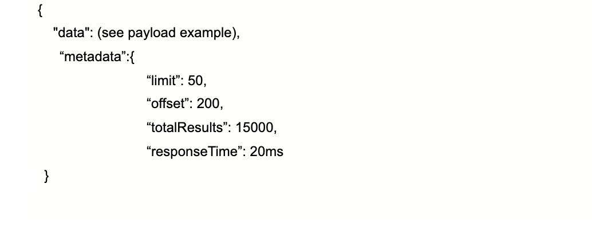
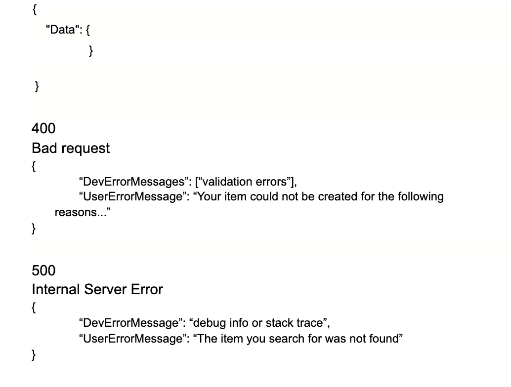
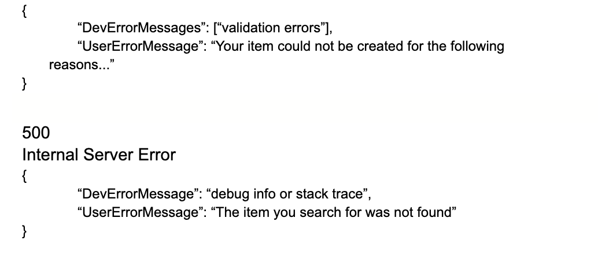

## Purpose

The housing tenure describes the legal status under which people/organizations have the right to occupy their accommodation.
 In UH we had different types of tenure such as tenancy agreements, Licences for temporary accommodation,Leasehold agreements,freehold and shared ownership. We have identified that the tenure entity is important for all processes related to most processes within the housing domain such as Manage a Tenancy,Manage arrears,service charge etc.

As part of our solution, we are proposing to develop the first version of this service as a pilot. This will help to target services more effectively, achieve better outcomes and enhance performance monitoring while reducing cost and risk.

Our goal is to ensure we build reusable components as part of the MTFH stream and thereby extending to other domains if they need similar information. This will enable us to eliminate the silos mechanism for asset information collection and help us to present a single view on it which will also help us to reduce the future development cost and yield a better ROI.

## Vision

- A single, centralized data source, holding all core tenure data, updated by multiple services.
- A reusable microservice API used for managing that data.
- Single data source to help us achieve consistency in data structure related to person’s data and remove duplication of resident data we hold.
- Reducing development efforts.

## Our users and their needs

** As a service user I need tenancy information so that: **

- I can identify the tenant living at the property to contact.
- I can identify the tenancy type to indicate the action I can take.
- I can identify from the current balance if the person is in arrears mode.
- I can identify if they have multiple accounts- dwelling,garages etc.
- I can identify if the household has any tenancy attached.
- I can see the tenancy agreements/documents attached to the tenancy.
- I can see the cautionary contact attached to the person.
- I can see if the tenancy agreement is only for a corporate account.
- I can see the tenancy start and end date of the tenancy to determine if it is current or former tenancy and accordingly take actions.
- I can see if the tenancy status is terminated or present.

** As a service user I need tenancy information so that: **

- I can identify the leaseholder if they reside at the same address.
- I can find if they have multiple accounts such as garages,major work,service charges etc.
- I can identify if there are any disputed balances attached to the account.
- I can identify if there is any payment arrangement in force.
- I can identify if the property has sub tenancy.

** As a service user I need tenancy information so that: **

- I can identify if the rent is up to date for shared ownership.
- I can identify if the service charge is up to date.
- I can identify if there is a reserve fund attached.

** As a consumer I need to have an API specification (e.g. Swagger doc, README), so that: **

- I can have a clear understanding of the endpoints which are available
- I know what the requests and responses should look like
- I need to be able to query for an individual tenure record or list of tenancies so that I can use the information as per the service needed in question.

** As a consumer I would like to have the option for paginated results so that: **

- The query duration doesn’t impact the performance of the frontend negatively
- I can set the page size for large results

** As a developer, I want to: **

- Built and reuse a single Tenure API microservice so that development efforts can be focused on other requirements
- Ensure data updated, retrieved and inserted is consistent across services and reliable
- Have an easy way to retrieve any data related to a Tenure so that I don’t need to make additional calls to find references for related systems

** As a developer I need to create an API specification so that: **

- I can help the external agency developer on quick onboarding
- I need to be notified when errors occur and have visibility of errors (e.g logs) and issues on the API, so that I can fix them as soon as possible.
- I need to make sure that access to the API is secure so that only authorised users can make requests to this API.
- I need to know the structure and content of the entities I am exposing data for, so that I know I am meeting user needs.

** As a developer I need to know which data this API will be concerned with, so that: **
- Endpoints are relevant
- I don’t duplicate data provided by other platform APIs

** As an application support analyst **
 - I need to understand the queries being used by the API so that I can deal with support requests accordingly and resolve the potential issues in the underlying data.

** As a data analyst I need to connect to the API via Qlik so that: **
- Data is easy to interpret and available for further reporting purposes.

## Workshop

https://ideaflip.com/b/bbc3jjr3zniq/

Entities dependent on Tenure API:

- Assets information
- Person
- Organisations
- Cautionary Alerts
- Communication details

## Endpoints to be created for core Tenure microservice

** Get Tenures:**
** Purpose: **  Gets one or more Tenures from the Tenure table.  Requests can be made by specifying a ref path parameter or searching for Tenures based on a series of parameters.
Endpoint URL:
- get/tenures
- get/tenures/?firstname
- get/tenures/?lastname
- get/tenures/?postcode
- get/tenures/{tenureid}

** Request Query String parameters: **

- First name - tenants first name
- Last name - tenants last name
- Postcode - tenants address

** Request Path Parameters: **
- Id - specifies the Id of a specific request record to return

** Response: **
- 200
- One or more help requests

404
If item was not found

** Post Tenures: **

Purpose: Created one or more tenures
- Endpoint URL: tenures/{tenureid}

Purpose: Add a person to a tenure
- Endpoint URL: tenures/{tenureid}/person/{personid}

**Request post object:**

    {
        "type": "Person",
        "fullName": "Person Full Name",
        "isResponsible": true,
        "dateOfBirth": "1951-02-11T00:00:00",
        "personTenureType": "Tenant|HouseholdMember"
    }

** Response: **
- 201

** Patch tenures: **

Purpose: Update one of more tenures
Endpoints URL:
            tenures/{tenureid}

** Request Put object: **
- TO BE ADDED

** Response: **
  - 204
  - Tenure Updated

404
Not found

** Payload: **

** Swagger: **

** What type of documents do we collect as part of the tenure entity? **

- Document issue -  which is the process of success/fail prior to application
- Tenure Application details
- List of invoices (link to invoice ID)
- Tenure agreements 
