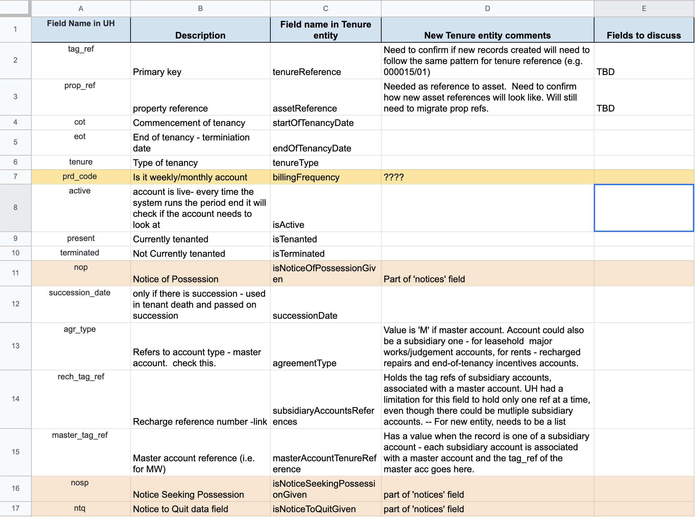
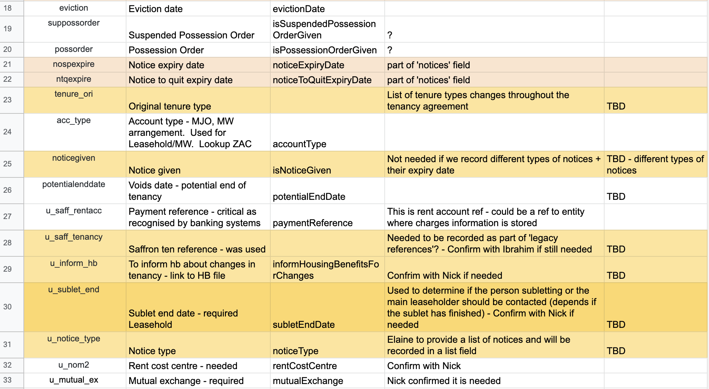
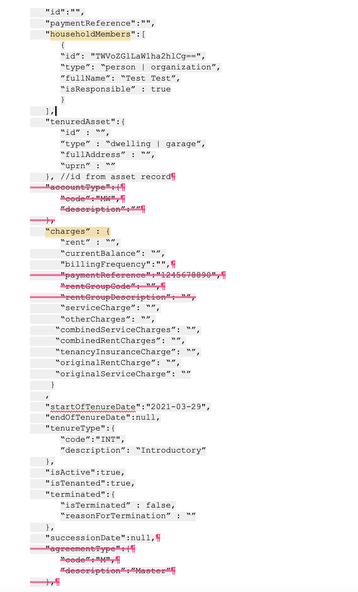
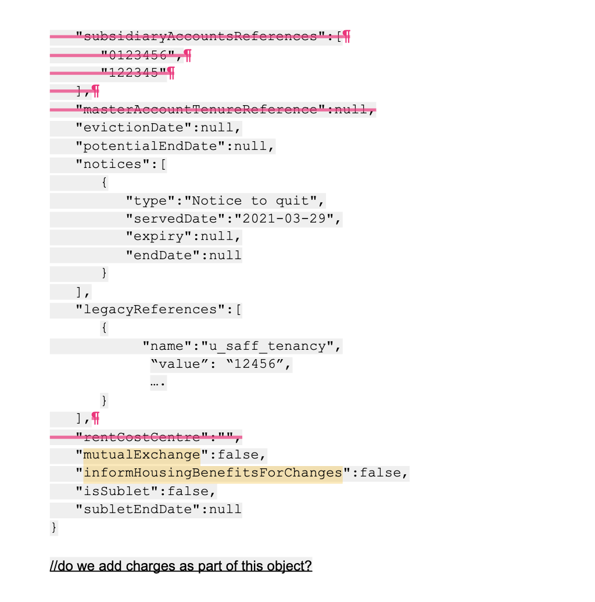

## Purpose and Context

** The purpose ** of this document is to define how the Tenure microservice and data entity will look. Tenure will be a data entity comprising of data related to:
- Tenancy agreements
- Lease agreements
- Other possible tenures (garages?)

This entity and API will be housing specific and will initially be populated with data migrated from UH’s ‘tenagree’ table.

The ‘tenagree’ table in UH was the main database table containing tenure agreement information. It consisted of more than 170 columns. This was due to the fact that the table had legacy, unused fields and fields that were stored in that table as there was no other suitable database table to store them into.

After several workshops and analysis, we have identified the minimum set of fields that will need to be part of the new tenure entity. The proposal is to create our first version of API and entity with those fields and expand as we find out more information about multiple other fields that we are currently unsure of where they will be stored.

** More on defining our first version of tenure entity below: **

https://docs.google.com/document/d/1Fvez4KdUos9KvjIcYTGjQdRefP7IXqWI4UZDur9tapw/edit

## Tenure entity fields

## Vision

- A single data source, holding various types of tenure agreements related to Housing.
-  reusable microservice API used for managing that data that could be used by multiple teams and housing services.
- An improved data entity consisting only of fields that are related to it and are actively used.
- Better naming conventions with meaningful field names.

## Questions still to be answered

- Need to confirm if new records created will need to follow the same pattern for tenure reference (e.g. 000015/01)
- Need to confirm how new asset references will look like. Will still need to migrate prop references.
- Are some of the legacy references still needed? E.g. u_saff_tenancy
- Do we need to record the people who live in a property that is leased?
- Do we have UPRN as reference to Assets?
- Are notices stored as codes with description?

## Our users and their needs

** As a service user I need tenancy information so that: **

- I can identify the tenant living at the property to contact.
- I can identify the tenancy type to indicate the action I can take.
- I can identify from the current balance if the person is in arrears mode.
- I can identify if they have multiple accounts- dwelling,garages etc.
- I can identify if the household has any tenancy attached.
- I can see the tenancy agreements/documents attached to the tenancy.
- I can see the cautionary contact attached to the person.
- I can see if the tenancy agreement is only for a corporate account.
- I can see the tenancy start and end date of the tenancy to determine if it is current or former tenancy and accordingly take actions.
- I can see if the tenancy status is terminated or present.

** As a service user I need tenancy information so that: **

- I can identify the leaseholder if they reside at the same address.
- I can find if they have multiple accounts such as garages,major work,service charges etc.
- I can identify if there are any disputed balances attached to the account.
- I can identify if there is any payment arrangement in force.
- I can identify if the property has sub tenancy.

** As a service user I need tenancy information so that: **

- I can identify if the rent is up to date for shared ownership.
- I can identify if the service charge is up to date.
- I can identify if there is a reserve fund attached.

** As a consumer I need to have an API specification (e.g. Swagger doc, README), so that: **

- I can have a clear understanding of the endpoints which are available
- I know what the requests and responses should look like

** As a consumer I need to be able to query for an individual tenure record or list of tenancies so that: **
-  I can use the information as per the service needed in question.

** As a consumer I would like to have the option for paginated results so that: **

- The query duration doesn’t impact the performance of the frontend negatively.
- I can set the page size for large results

** As a developer, I want to: **

- Built and reuse a single Tenure API microservice so that development efforts can be focused on other requirements
- Ensure data updated, retrieved and inserted is consistent across services and reliable
- Have an easy way to retrieve any data related to a Tenure so that I don’t need to make additional calls to find references for related systems

** As a developer I need to create an API specification so that: **

- I can provide clear documentation about endpoints and payloads, etc.
- I can help the external agency developer on quick onboarding.

** As a developer I need to be notified when errors occur and have visibility of errors (e.g logs) and issues on the API, so that: **
-  I can fix them as soon as possible.

** As a developer I need to make sure that access to the API is secure so that:
-  only authorised users can make requests to this API.

** As a developer I need to know the structure and content of the entities I am exposing data for, so that:
-  I know I am meeting user needs.

** As a developer I need to know which data this API will be concerned with, so that: **

- Endpoints are relevant
- I don’t duplicate data provided by other platform APIs

** As an application support analyst: **

 - I need to understand the queries being used by the API so that I can deal with support requests accordingly and resolve the potential issues in the underlying data.

** As a data analyst I need to connect to the API via Qlik so that: **

-Data is easy to interpret and available for further reporting purposes.

## Endpoints to be created

              GET /tenures/{id}
              Retrieves a tenure record
              GET /tenures/targetId={id}
              Retrieves tenure records for a person/organization
              POST /tenures
              Inserts a new tenure record
              PUT /tenures/{id}
              TBC which fields should be updatable

## Dependent Entities

- Person
- Organization
- Asset
- Finance entities related to tenures(Name TBC)
- Manage arrears entities linking to tenures
- Repairs entities linking to tenures

## Example payload

